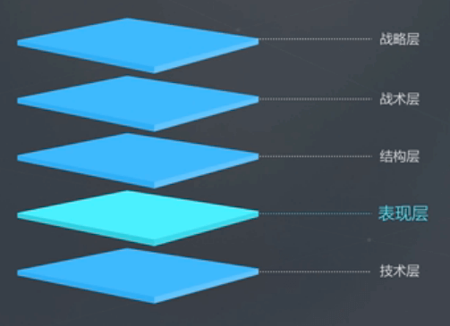
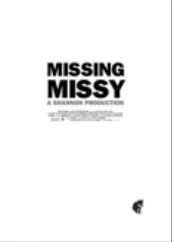
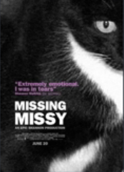
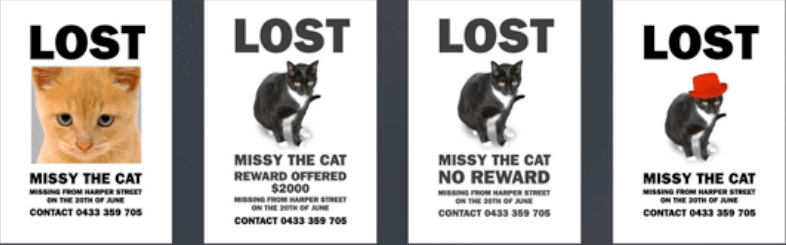

<!-- START doctoc generated TOC please keep comment here to allow auto update -->
<!-- DON'T EDIT THIS SECTION, INSTEAD RE-RUN doctoc TO UPDATE -->
**Table of Contents**  *generated with [DocToc](https://github.com/thlorenz/doctoc)*

- [什么是UI设计](#%E4%BB%80%E4%B9%88%E6%98%AFui%E8%AE%BE%E8%AE%A1)
  - [开发流程](#%E5%BC%80%E5%8F%91%E6%B5%81%E7%A8%8B)
  - [设计目的](#%E8%AE%BE%E8%AE%A1%E7%9B%AE%E7%9A%84)

<!-- END doctoc generated TOC please keep comment here to allow auto update -->

# 什么是UI设计

## 开发流程

- **老板** 在战略层次上提出概念，考虑市场前景
- **产品经理** 在战术层次上设计产品，考虑具体实施
- **交互设计师** 在结构层设计界面结构和使用交互，用户操作和体验
- **UI设计师** 在表现层上设计具体界面，考虑视觉效果、品牌效果
- **开发工程师** 在技术层考虑具体实现

UI设计师在表现层上设计具体界面，考虑视觉效果、品牌效果。

## 设计目的

**商业价值最大化**

举个例子：《寻猫千万别找设计师》，猫不见了，他请朋友设计一个寻猫启示。

第一版是这样的：

可以看出很有艺术感，但是人们看了根本不知道这是一个什么东西。

第二版是这样的：

终于把猫放上去了，但是猫只放了半张脸，人们还是不知道这张海报想表达的意思。

之后经过无数次的修改，最终是这样的：

最终这个版本我们看了才知道是寻猫启事。所以这个例子告诉我们，**在设计的时候不要单纯追求美，而忘记了设计的目的。**