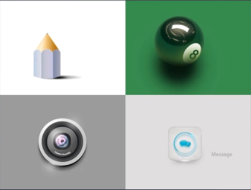

<!-- START doctoc generated TOC please keep comment here to allow auto update -->
<!-- DON'T EDIT THIS SECTION, INSTEAD RE-RUN doctoc TO UPDATE -->
**Table of Contents**  *generated with [DocToc](https://github.com/thlorenz/doctoc)*

- [UI设计的成长路径](#ui%E8%AE%BE%E8%AE%A1%E7%9A%84%E6%88%90%E9%95%BF%E8%B7%AF%E5%BE%84)
  - [PS技术阶段](#ps%E6%8A%80%E6%9C%AF%E9%98%B6%E6%AE%B5)
  - [临摹阶段](#%E4%B8%B4%E6%91%B9%E9%98%B6%E6%AE%B5)
  - [设计阶段](#%E8%AE%BE%E8%AE%A1%E9%98%B6%E6%AE%B5)
  - [理论积累](#%E7%90%86%E8%AE%BA%E7%A7%AF%E7%B4%AF)

<!-- END doctoc generated TOC please keep comment here to allow auto update -->

# UI设计的成长路径

一般UI设计师的成长路径可以分为以下几个阶段：

- PS技术阶段
- 临摹阶段
- 设计阶段
- 积累理论

## PS技术阶段

主要是学习如何使用Photoshop、Illustrator这些设计软件。

## 临摹阶段

临摹是UI设计最为关键的一步，没有临摹，你无法掌握UI设计所需要的技能，更别说自己设计了。一般来说，临摹有几个层次：

- 第一层：印着画，锻炼参数设置能力
- 第二层：不印排版，锻炼布局手感
- 第三层：不吸颜色，锻炼配色能力
	
临摹的东西主要是：APP/ICON/活动页/BANNER，也就是UI设计师的主要工作内容。
	

	
***TIPS：临摹的时候注意：字体、配色、对齐线、间距、对比度、大小、质感。***
	
## 设计阶段

临摹这个阶段半年左右就会有一些经验积累，之后可以尝试自主设计并积累经验、作品。

## 理论积累

当可以设计自己作品的时候，你还需要不断地深入学习设计理论，进一步巩固自己的理论基础。多看一些设计方面的书籍，内化自己的软实力。

	
	