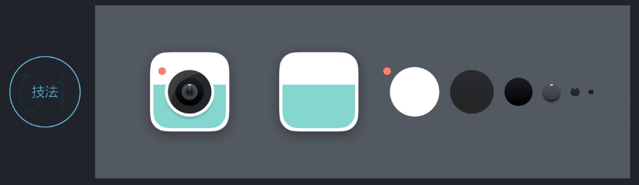
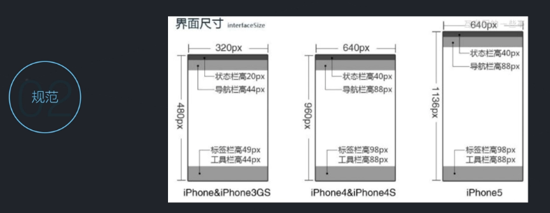
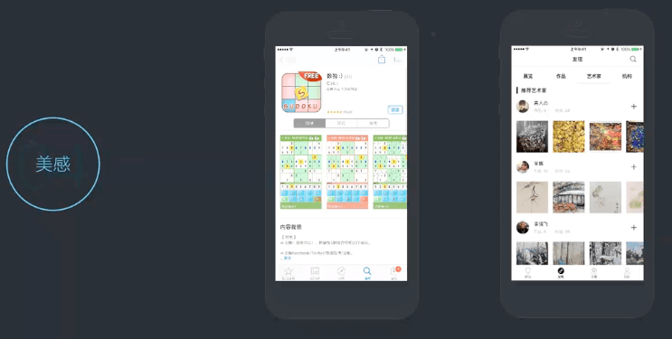
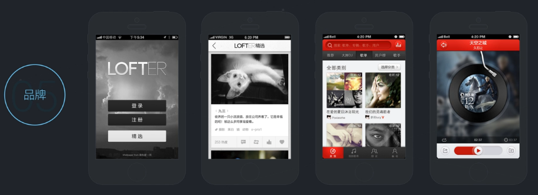

<!-- START doctoc generated TOC please keep comment here to allow auto update -->
<!-- DON'T EDIT THIS SECTION, INSTEAD RE-RUN doctoc TO UPDATE -->
**Table of Contents**  *generated with [DocToc](https://github.com/thlorenz/doctoc)*

- [UI设计的五大系统](#ui%E8%AE%BE%E8%AE%A1%E7%9A%84%E4%BA%94%E5%A4%A7%E7%B3%BB%E7%BB%9F)
    - [技法](#%E6%8A%80%E6%B3%95)
    - [规范](#%E8%A7%84%E8%8C%83)
    - [用户体验](#%E7%94%A8%E6%88%B7%E4%BD%93%E9%AA%8C)
    - [美感](#%E7%BE%8E%E6%84%9F)
    - [品牌](#%E5%93%81%E7%89%8C)

<!-- END doctoc generated TOC please keep comment here to allow auto update -->

# UI设计的五大系统

### 技法

只有一定的技术才能实现自己心中所想，技法就是实现心中所想的技术。

### 规范

规范可以让你知道一些基本的设计原则，少出错误。

规范可以分为两种：

- iOS、安卓规范
- 产品品牌设计规范（重点）

### 用户体验

掌握一些科学的设计方法，设计出用户体验更好的作品。

### 美感

提升美感是设计师职业生涯里的努力方向。

### 品牌

一个品牌是如何设计出来的

