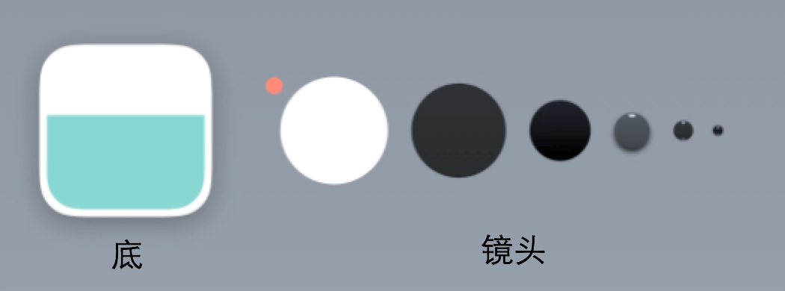

<!-- START doctoc generated TOC please keep comment here to allow auto update -->
<!-- DON'T EDIT THIS SECTION, INSTEAD RE-RUN doctoc TO UPDATE -->
**Table of Contents**  *generated with [DocToc](https://github.com/thlorenz/doctoc)*

- [扁平化icon实际演示](#%E6%89%81%E5%B9%B3%E5%8C%96icon%E5%AE%9E%E9%99%85%E6%BC%94%E7%A4%BA)

<!-- END doctoc generated TOC please keep comment here to allow auto update -->

# 扁平化icon实际演示

首先先剖析ICON的整体结构，可以看到ICON由底座和镜头组成

之后用圆角矩形工具画个底座

之后画对应的镜头部分

相机的基本形状出来了，但是缺少了一些细节，比如：高光。下面我们给镜头加上一些高光。

现在看起来是不是更好了呢。这里其实还有许多的细节需要处理，有时间的时候多做几次，就能注意到平时没注意到的细节。

**总结：对于CION来说，颜色以及形体的归纳才是最重要的，而细节不是特别重要的。**