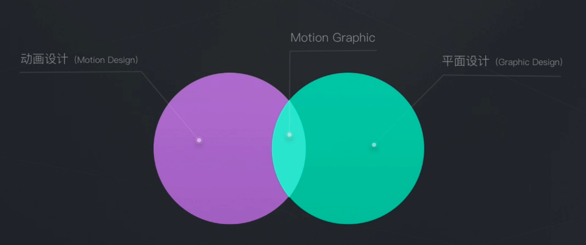

# 华丽的动效设计

**什么是动效？**

动效 = Motion Graphic，即会动的图片。动效属于动画设计学科，是动画设计和平面设计的交集。

动效设计：动态的图片，传递信息，表达氛围。

**动效的作用？**

产品展示、品牌建设、交互展示

**UI为什么需要动效？**

流畅过渡、高效反馈、增强操纵、帮助引导、升华体验

流畅过渡，提现按钮点击后的过渡效果

转动的小圆圈可以反馈下载的进度

翻页的效果做得非常真实

运用动效来引导用户发现新功能

运用动效来增强品牌辨识度

**做动效容易踩的坑？**

- 做的动效太复杂繁琐。因此做动效的时候要尽量简洁适度。
- 要考虑开发成本。太炫的动效开发成本可能很高。
- 要考虑性能和响应度。让用户等太久是不好的。