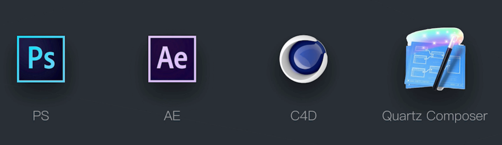

# 如何制作动效

制作动效一般分为以下几步：兵器选择、制作静帧素材、精简图层、导入PSD文档、动效制作。

## 兵器选择

一般制作动效的有如下几个常用的软件，我们选择了AE CC来制作动效。

`AE CC`软件的界面主要分为几大部分：素材区、预览区、图层区、时间轴。

## 制作静帧素材

首先把所有的静态图片都出来，并设计好出现的流程顺序。下图第一步是一开始出现的样子、第二步是出现后的样子、第三步是滑动的样子、第四步是滑动的时候列表的样子、第五步是滑动后的样子。

## 精简图层

精简图层就是在PS软件里把可以合并的图层合并起来，避免在制作动效的时候出现太多图层，干扰动效制作。这就需要你判断素材图片里哪些元素是在动效制作过程中变化的，变化的图层就不能合并，不变化的图层就可以合并。

## 导入PSD素材

使用`AE CC`来制作动效，导入素材的时候，记得用`“合成”->“可编辑的”`选项导入素材。

## 动效制作

当我们把所有PSD素材导入到`AE CC`里面之后，我们就可以开始制作动效了。下面是`AE CC`软件常用到的一些快捷键，熟记它们将极大的方便你进行动效制作。

|命令|作用|
|:---:|:---:|
|command+K|打开合成设置|
|command + shift + 方向键|快速移动时间线（一次10帧）|
|commnd + 方向键|快速移动时间线：（一次1帧）|
|option + 方向键|移动1个关键帧|
|选中两个帧，按下F9|设置为缓入缓出帧|
|选中关键帧，command+鼠标左键|取消缓入缓出|
|选中图层，P键|调出位置面板|
|J|上一个关键帧|
|K|下一个关键帧|
|B键|选择当前时间线位置为预览窗口的开始位置|
|N键|选择当前时间线位置为预览窗口的结束位置|
|~|屏幕最大化|
|选中图层，S键|打开缩放属性设置|
|选中图层，T键|打开透明度属性设置|
|选中图层，U键|调出关键帧|
|command+Shift+H|隐藏所有辅助对象|

分辨率1080*1920，帧速30帧/秒。