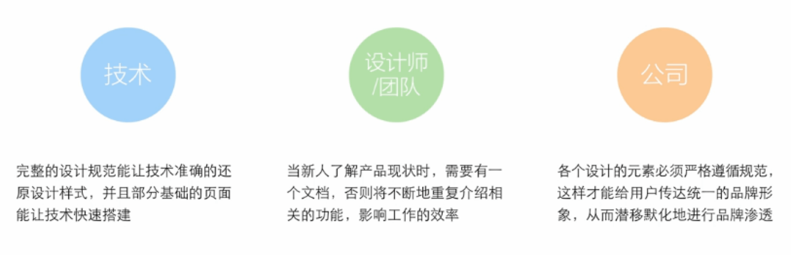
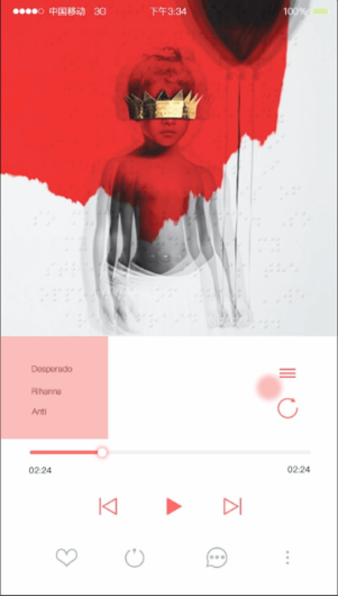
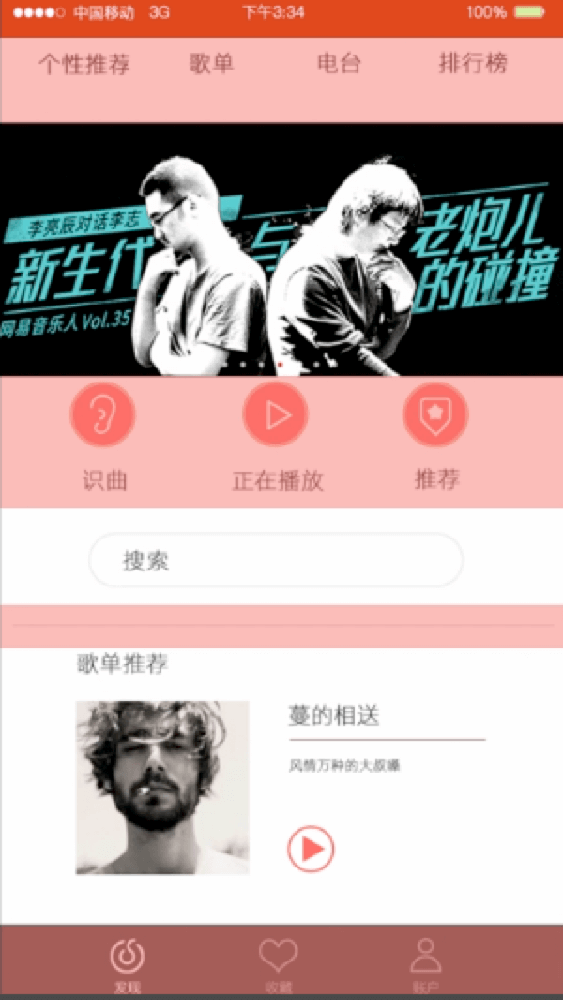

<!-- START doctoc generated TOC please keep comment here to allow auto update -->
<!-- DON'T EDIT THIS SECTION, INSTEAD RE-RUN doctoc TO UPDATE -->
**Table of Contents**  *generated with [DocToc](https://github.com/thlorenz/doctoc)*

- [设计规范与流程](#%E8%AE%BE%E8%AE%A1%E8%A7%84%E8%8C%83%E4%B8%8E%E6%B5%81%E7%A8%8B)

<!-- END doctoc generated TOC please keep comment here to allow auto update -->

# 设计规范与流程

**设计规范**

设计规范是指由视觉设计师定下的对色彩、控件样式、布局排版字体等制定的一系列规则，用来指导之后的设计工作，确保视觉风格的一致性。控制设计质量，提高设计效率。

**设计规范为谁服务**

**设计规范的好处**

- 可以控制设计质量。设计规范可以让UI的界面展现更加统一、视觉元素的运用也非常规范，用户浏览时会感觉非常流畅、舒适。

- 可以提高设计效率。有了统一的规范就可以将所有的页面整理出一套规则，在遵循规则的情况下进行设计，页面的设计也会变得简单、方便。

如果没有设计规范，那么设计出来的页面很可能跟下面的一样。

