<!-- START doctoc generated TOC please keep comment here to allow auto update -->
<!-- DON'T EDIT THIS SECTION, INSTEAD RE-RUN doctoc TO UPDATE -->
**Table of Contents**  *generated with [DocToc](https://github.com/thlorenz/doctoc)*

- [iOS系统平台](#ios%E7%B3%BB%E7%BB%9F%E5%B9%B3%E5%8F%B0)
  - [iOS屏幕分辨率](#ios%E5%B1%8F%E5%B9%95%E5%88%86%E8%BE%A8%E7%8E%87)
  - [iOS系统设计规范](#ios%E7%B3%BB%E7%BB%9F%E8%AE%BE%E8%AE%A1%E8%A7%84%E8%8C%83)
  - [icon设计规范](#icon%E8%AE%BE%E8%AE%A1%E8%A7%84%E8%8C%83)
  - [文字使用规范](#%E6%96%87%E5%AD%97%E4%BD%BF%E7%94%A8%E8%A7%84%E8%8C%83)
  - [配色规范](#%E9%85%8D%E8%89%B2%E8%A7%84%E8%8C%83)
  - [UI手势交互](#ui%E6%89%8B%E5%8A%BF%E4%BA%A4%E4%BA%92)
  - [UI动画概述](#ui%E5%8A%A8%E7%94%BB%E6%A6%82%E8%BF%B0)
  - [点击区域](#%E7%82%B9%E5%87%BB%E5%8C%BA%E5%9F%9F)

<!-- END doctoc generated TOC please keep comment here to allow auto update -->

# iOS系统平台

## iOS屏幕分辨率

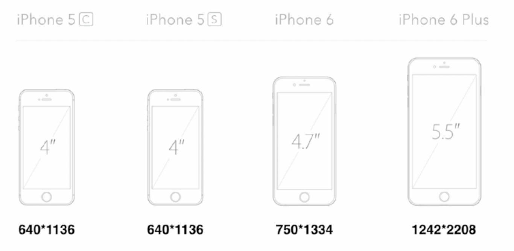

## iOS系统设计规范

苹果官方给出了iOS系统设计的一些规范，例如有搜索框时候顶部的设计、icon大小以及字号、列表的设计等。你可以在这里查询查阅iOS系统的设计规范。

iOS系统具体空间的设计规范

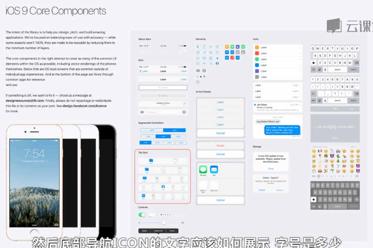

iOS系统具体界面的设计规范

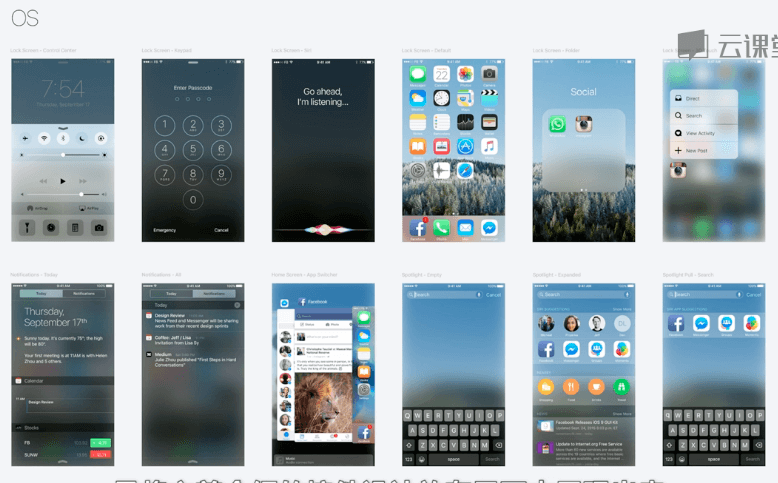

## icon设计规范

iOS 系统里的 icon 主要有以下几个地方：

- iOS 主屏幕的 icon
- Apple Store 里 icon的展现
- icon在列表里的展现

这几个地方的icon都拥有不同的尺寸，并且Retina屏幕和普通屏幕也是有区别的。

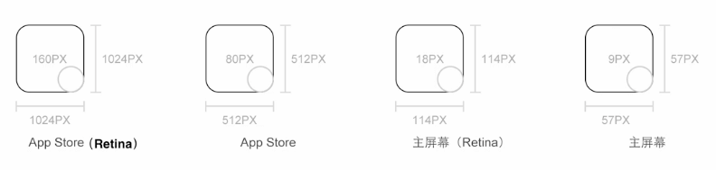

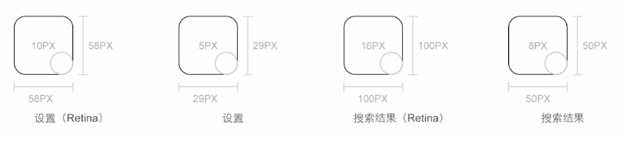

**icon使用规范**

## 文字使用规范

- 设计字体建议为：**黑体、简体、Heiti SC**，这时与iOS系统视觉效果最接近的字体。
- 字体大小都应为**偶数**，建议最小文字**不小于22px**。

**苹果官方的UI设计**

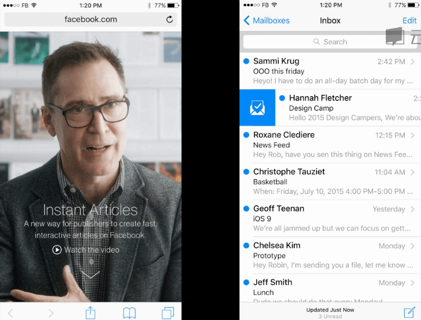

## 配色规范

- 纯色为主
- 通常将主色调作为点击色

**案例**

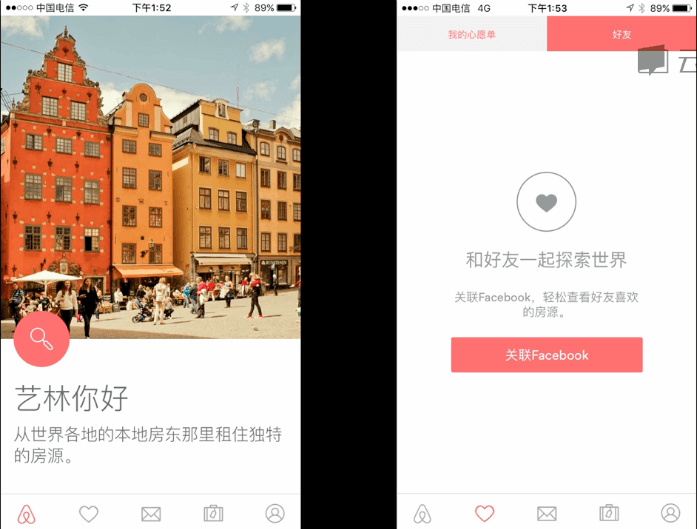

Airbnb的配色所有行动点的配色都是红色，底部大量留白，文字颜色是比较灰的颜色，用大小来区别主要的文字信息和次要的文字信息。

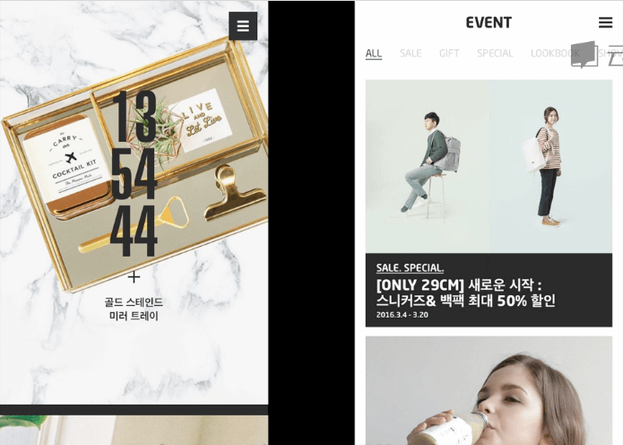

韩国电商的App里，模特图都是在浅色底上，所有文字都在一个深色底上，使得文字非常清晰。

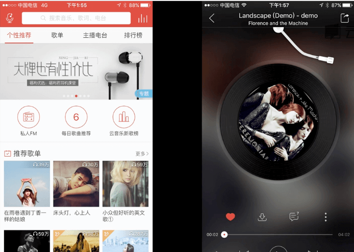

网易云音乐的App里，主要以红色为主，白色为辅，底部大量留白，红色作为标题栏的一个品牌色，导航栏里红色作为一个点击色。

## UI手势交互

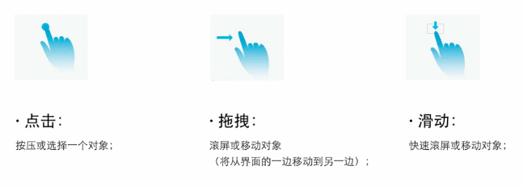

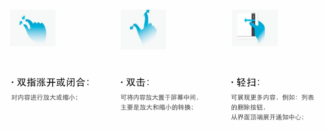

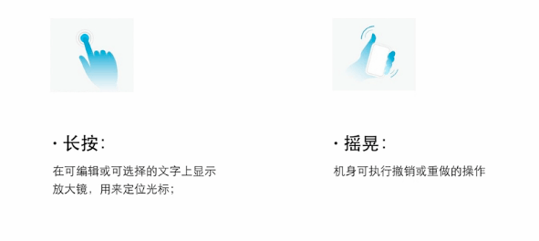

## UI动画概述

- 传达状态

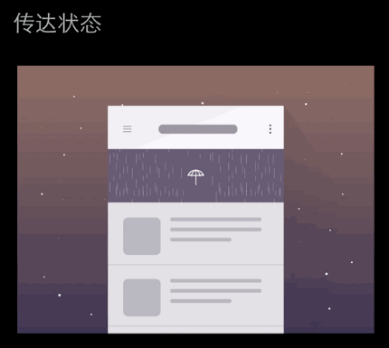

往下拉后出现的下雨动画传达了等待的信号

- 通过视觉化的方式向用户呈现操作结果

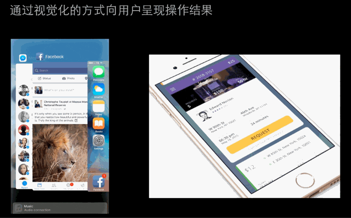

当我们双击home键时会以重叠的方式出现所有的APP，这时候向上push就可以丢掉。右边的动画当我们点击时可以打开折叠，看到更多的信息。

## 点击区域

**点击区域**所有能点击的区域都不能小于88px，如是在满足不了可缩小视觉空间的大小，但是还是需要保留点击区域的大小。

组成部分：

- 导航栏

一般包括：状态栏目和导航栏、标题导航栏、底部导航栏

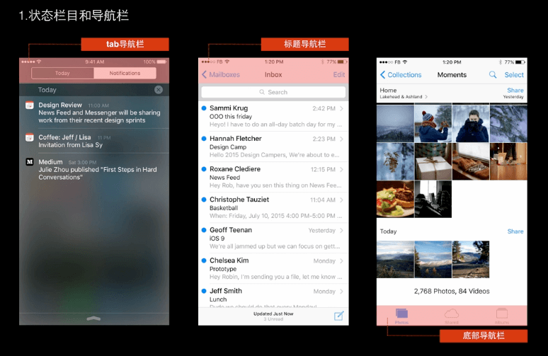

- 内容视图

展示主要内容信息，包括相关的交互行为，例如滚屏、插入、删除等操作进行排

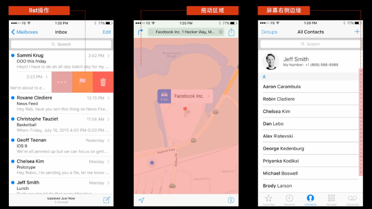

- 产品行为或显示的信息按钮、输入框

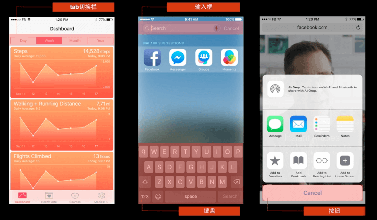

- 临时视图：临时向用户提供重要的信息，或提供额外的功能和选项

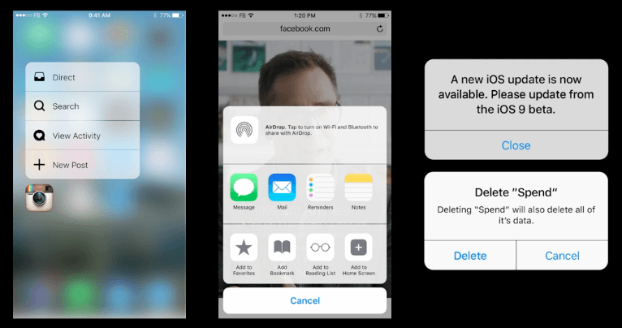

