<!-- START doctoc generated TOC please keep comment here to allow auto update -->
<!-- DON'T EDIT THIS SECTION, INSTEAD RE-RUN doctoc TO UPDATE -->
**Table of Contents**  *generated with [DocToc](https://github.com/thlorenz/doctoc)*

- [Android系统平台](#android%E7%B3%BB%E7%BB%9F%E5%B9%B3%E5%8F%B0)
  - [屏幕分辨率](#%E5%B1%8F%E5%B9%95%E5%88%86%E8%BE%A8%E7%8E%87)
  - [UI官方设计规范](#ui%E5%AE%98%E6%96%B9%E8%AE%BE%E8%AE%A1%E8%A7%84%E8%8C%83)
  - [ICON设计规范](#icon%E8%AE%BE%E8%AE%A1%E8%A7%84%E8%8C%83)
  - [计量单位 DP](#%E8%AE%A1%E9%87%8F%E5%8D%95%E4%BD%8D-dp)
  - [字体设计规范](#%E5%AD%97%E4%BD%93%E8%AE%BE%E8%AE%A1%E8%A7%84%E8%8C%83)
  - [配色规范](#%E9%85%8D%E8%89%B2%E8%A7%84%E8%8C%83)
  - [触控范围](#%E8%A7%A6%E6%8E%A7%E8%8C%83%E5%9B%B4)
  - [手势](#%E6%89%8B%E5%8A%BF)
  - [触摸反馈](#%E8%A7%A6%E6%91%B8%E5%8F%8D%E9%A6%88)
  - [动画](#%E5%8A%A8%E7%94%BB)

<!-- END doctoc generated TOC please keep comment here to allow auto update -->

# Android系统平台

## 屏幕分辨率

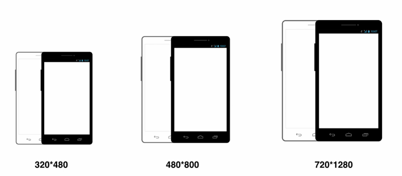

## UI官方设计规范

**白色背景**

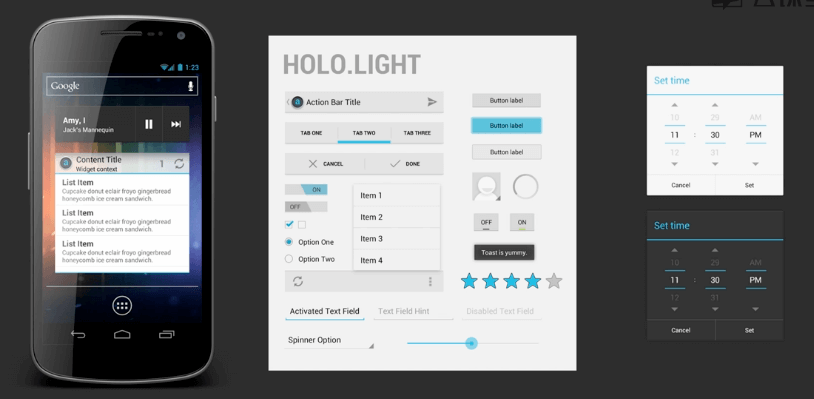

**黑色背景**

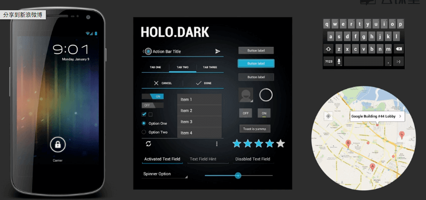

## ICON设计规范

Android的ICON设计没有像iOS那么严格，所以ICON可能是圆角的，也可能是直角的。安卓的icon比较象形、平面、不要有太多的细节。

- 启动图标

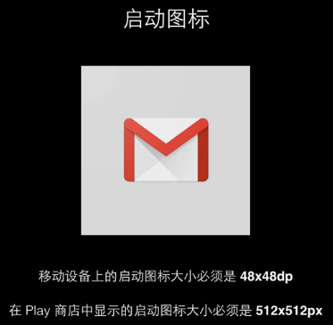

- 操作栏

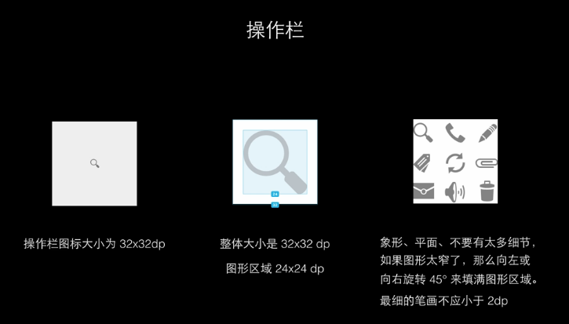

## 计量单位 DP

px 是像素的概念，DP是一个变量、整数倍、开发用的像素单位。

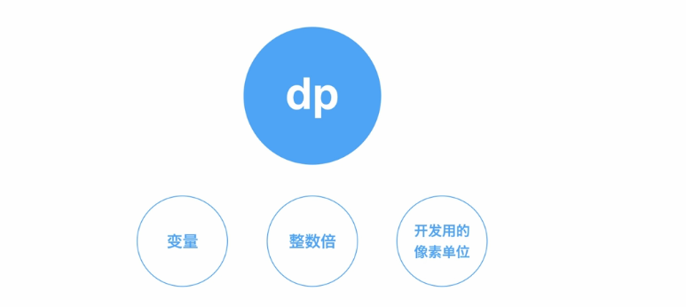

在两倍屏幕中，1DP就是2px。

## 字体设计规范

**不规范的例子**

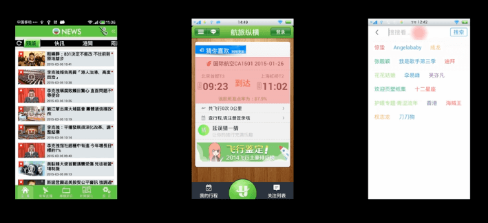

**规范的例子**

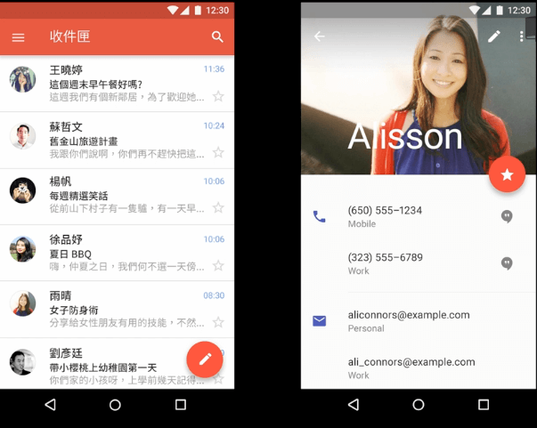

**文字使用规范-ROBOTO（英文）**

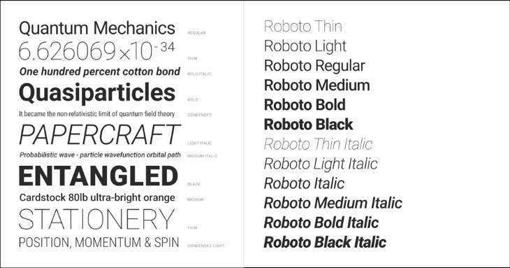

**中文字体使用规范——Noto Snas CJK(思源黑体)**

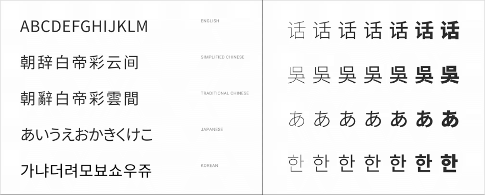

## 配色规范

配色的时候确定三个色：基础色、强调色、主题色。

 

## 触控范围

48DP的设计韵律：指的是触控范围要做到48DP，但不是指按钮高度必须达到48DP。

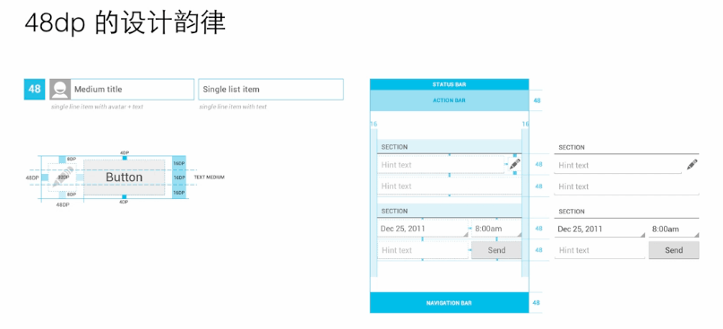

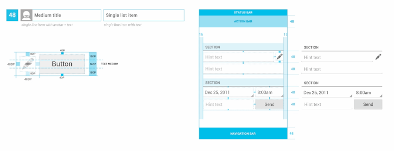

## 手势

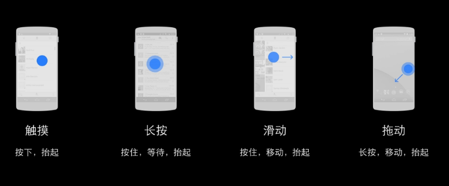

## 触摸反馈

大多数安卓UI元素都有触摸反馈，这是为了表达元素的视觉效果。

## 动画

- 交流

- 不可滑动的视觉反馈

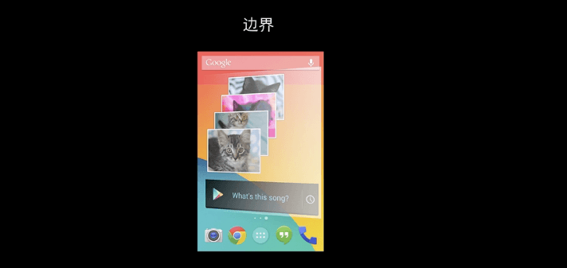

