<!-- START doctoc generated TOC please keep comment here to allow auto update -->
<!-- DON'T EDIT THIS SECTION, INSTEAD RE-RUN doctoc TO UPDATE -->
**Table of Contents**  *generated with [DocToc](https://github.com/thlorenz/doctoc)*

- [如何做移动端设计规范](#%E5%A6%82%E4%BD%95%E5%81%9A%E7%A7%BB%E5%8A%A8%E7%AB%AF%E8%AE%BE%E8%AE%A1%E8%A7%84%E8%8C%83)
  - [主流标注软件](#%E4%B8%BB%E6%B5%81%E6%A0%87%E6%B3%A8%E8%BD%AF%E4%BB%B6)
    - [PS CC](#ps-cc)
    - [AI CC](#ai-cc)
    - [Sketch](#sketch)
  - [制定设计规范的时间](#%E5%88%B6%E5%AE%9A%E8%AE%BE%E8%AE%A1%E8%A7%84%E8%8C%83%E7%9A%84%E6%97%B6%E9%97%B4)
  - [网易考拉APP设计规范](#%E7%BD%91%E6%98%93%E8%80%83%E6%8B%89app%E8%AE%BE%E8%AE%A1%E8%A7%84%E8%8C%83)
    - [色彩规范](#%E8%89%B2%E5%BD%A9%E8%A7%84%E8%8C%83)
    - [控件规范](#%E6%8E%A7%E4%BB%B6%E8%A7%84%E8%8C%83)
    - [文字排版规范](#%E6%96%87%E5%AD%97%E6%8E%92%E7%89%88%E8%A7%84%E8%8C%83)
  - [快速标注工具 Markman](#%E5%BF%AB%E9%80%9F%E6%A0%87%E6%B3%A8%E5%B7%A5%E5%85%B7-markman)

<!-- END doctoc generated TOC please keep comment here to allow auto update -->

# 如何做移动端设计规范

## 主流标注软件

### PS CC

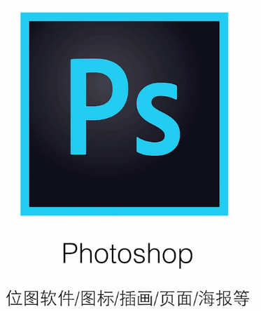

### AI CC

### Sketch

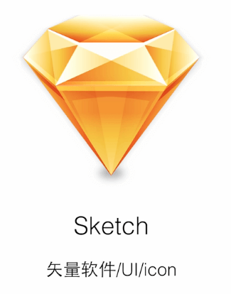

## 制定设计规范的时间

制定设计规范最好的时间点是**做好整套UI设计后**，因为此时整体的设计已经确定。

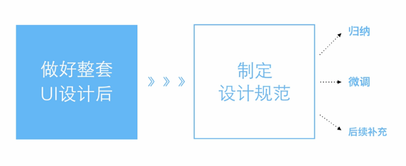

## 网易考拉APP设计规范

下面以网易考拉APP为例子来说明移动端的设计规范。

### 色彩规范

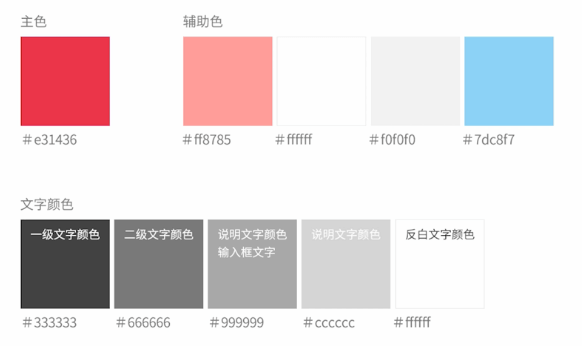

### 控件规范

#### 顶部导航

说明设计的内容以及设计尺寸，并用图片标注。

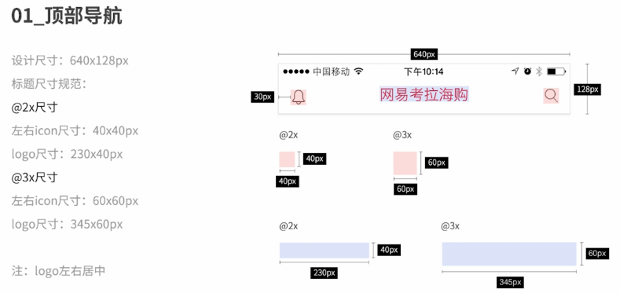

#### 标题栏

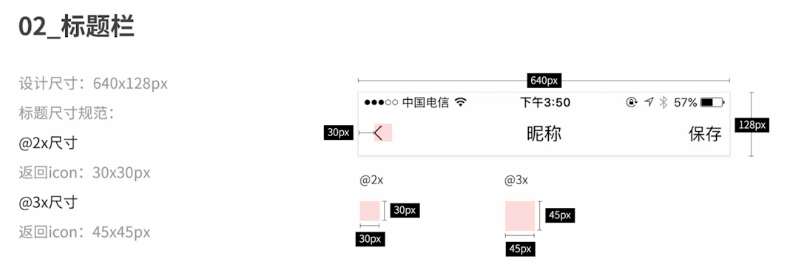

#### 底部导航

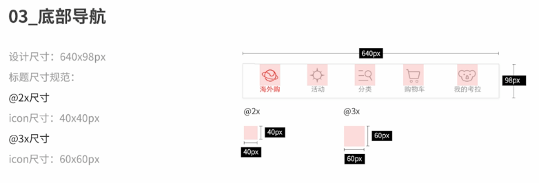

#### 二级导航

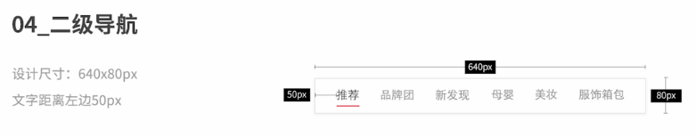

#### 列表

#### 输入框

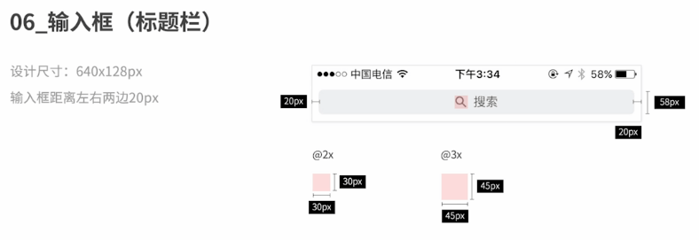

#### 浮层

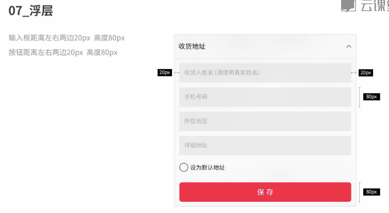

#### 主按钮

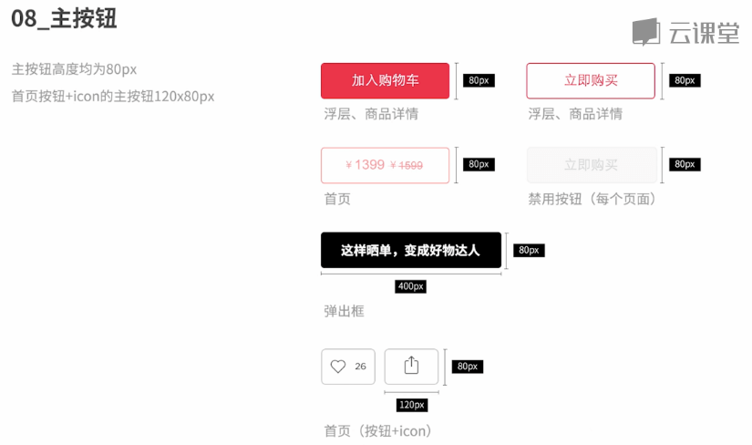

#### 次按钮

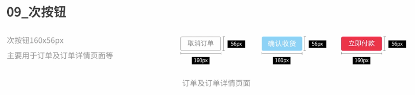

#### 弹出框

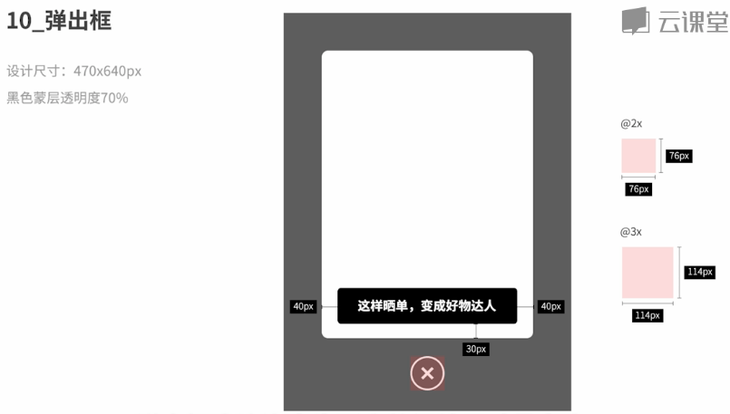

### 文字排版规范

#### 标题栏

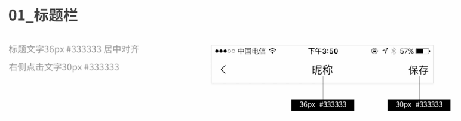

#### 底部导航

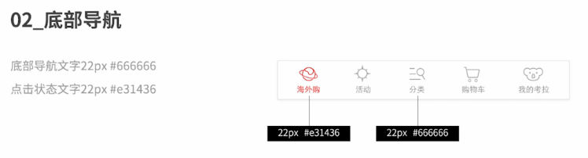

#### 二级导航

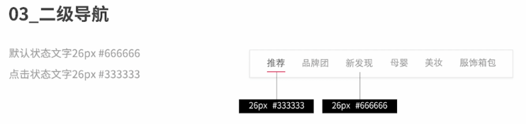

#### 列表

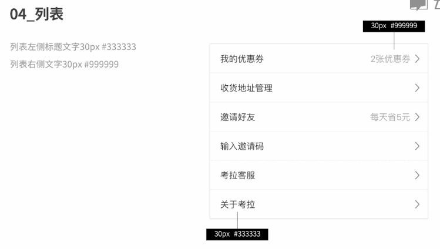

#### 输入框（标题栏）

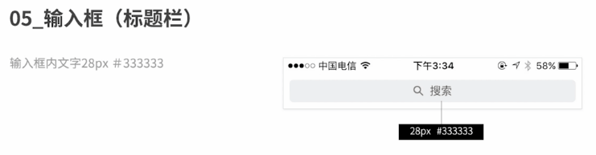

#### 输入框（列表）

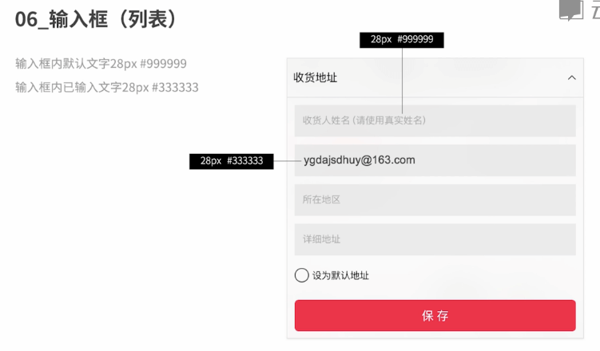

#### 主按钮

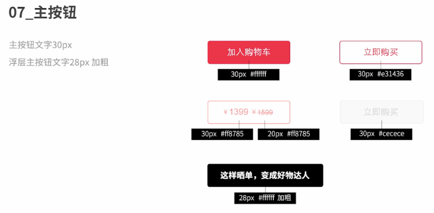

#### 次按钮

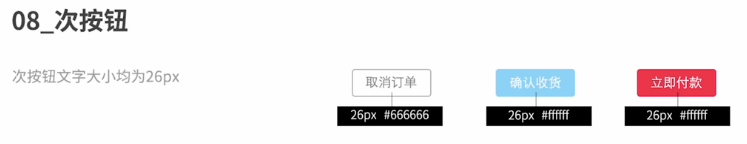

#### 商品列表

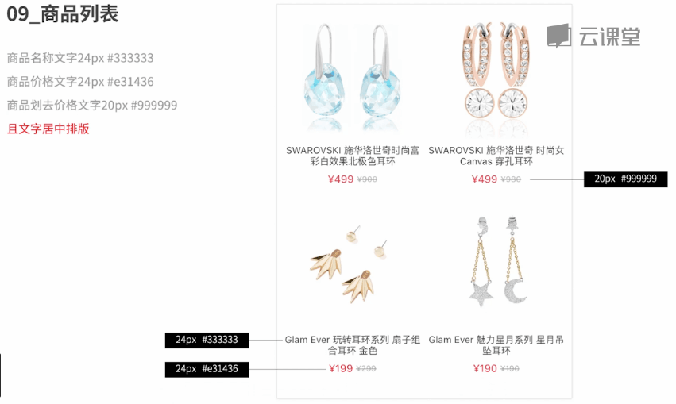

#### 搜索面板

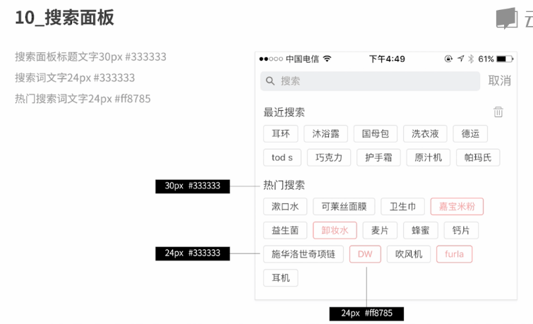

**移动端文字设计规范总结**

- 标题文字：36px-30px
- 正文文字：30px-24px
- 说明文字：24px-22px

**成N倍的文字颜色输出**

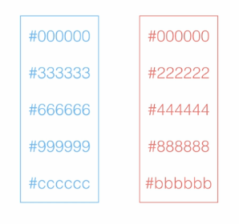

## 快速标注工具 Markman

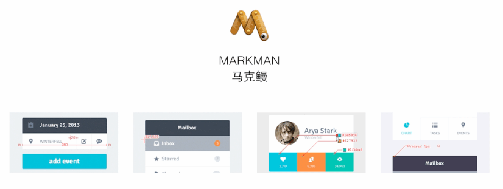

