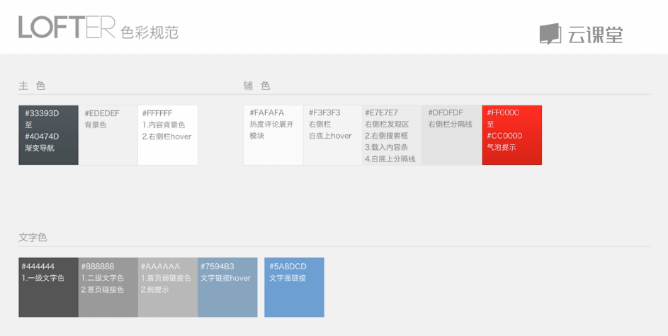
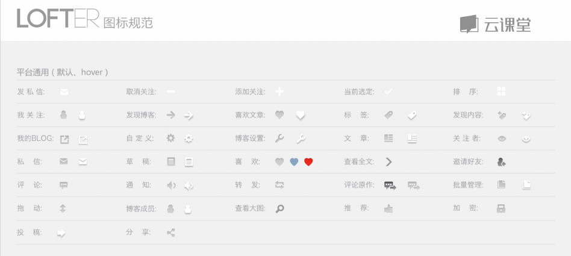
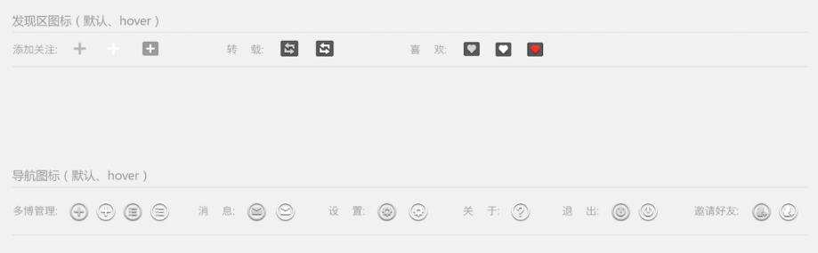
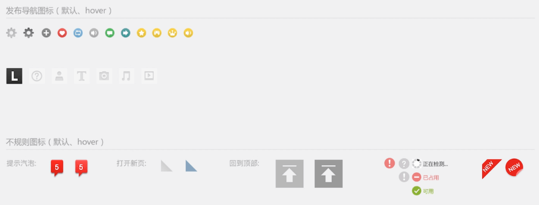
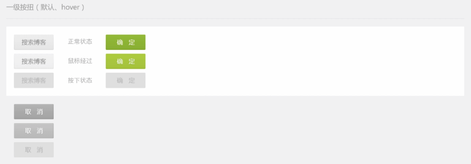
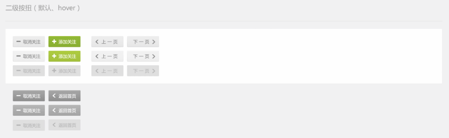
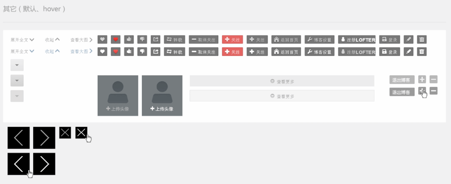
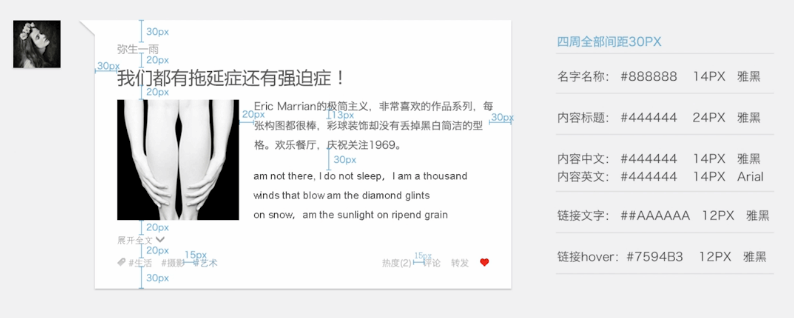
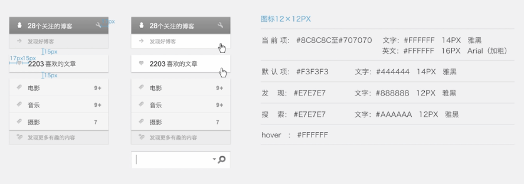
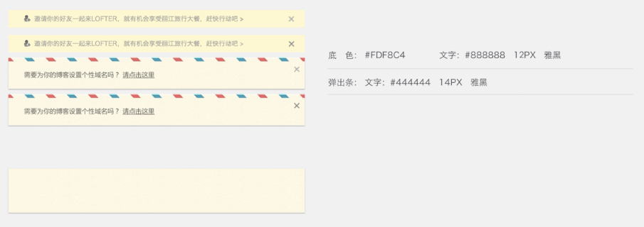

<!-- START doctoc generated TOC please keep comment here to allow auto update -->
<!-- DON'T EDIT THIS SECTION, INSTEAD RE-RUN doctoc TO UPDATE -->
**Table of Contents**  *generated with [DocToc](https://github.com/thlorenz/doctoc)*

- [如何做WEB端设计规范](#%E5%A6%82%E4%BD%95%E5%81%9Aweb%E7%AB%AF%E8%AE%BE%E8%AE%A1%E8%A7%84%E8%8C%83)
  - [色彩规范](#%E8%89%B2%E5%BD%A9%E8%A7%84%E8%8C%83)
  - [图标规范](#%E5%9B%BE%E6%A0%87%E8%A7%84%E8%8C%83)
  - [控件规范](#%E6%8E%A7%E4%BB%B6%E8%A7%84%E8%8C%83)
    - [一级按钮](#%E4%B8%80%E7%BA%A7%E6%8C%89%E9%92%AE)
    - [二级按钮](#%E4%BA%8C%E7%BA%A7%E6%8C%89%E9%92%AE)
    - [其他](#%E5%85%B6%E4%BB%96)
  - [排版规范](#%E6%8E%92%E7%89%88%E8%A7%84%E8%8C%83)
    - [下拉列表规范](#%E4%B8%8B%E6%8B%89%E5%88%97%E8%A1%A8%E8%A7%84%E8%8C%83)
    - [文章排版规范](#%E6%96%87%E7%AB%A0%E6%8E%92%E7%89%88%E8%A7%84%E8%8C%83)
    - [列表页规范](#%E5%88%97%E8%A1%A8%E9%A1%B5%E8%A7%84%E8%8C%83)
    - [提示弹窗](#%E6%8F%90%E7%A4%BA%E5%BC%B9%E7%AA%97)

<!-- END doctoc generated TOC please keep comment here to allow auto update -->

# 如何做WEB端设计规范

本章节将以LOFTER WEB的设计为例，介绍Web端设计规范的各个组成部分，主要色彩规范、排版规范、图标规范等。

## 色彩规范

要标明颜色都用在哪些地方

## 图标规范

hover状态都是白色带投影，而默认的图标都是灰色。

根据功能进行图标整理可以方便设计人员进行设计：

## 控件规范

按钮、导航栏、输入框等

### 一级按钮

### 二级按钮

二级按钮与一级按钮的区别只是在大小上偏小一些，有时候颜色可能没一级按钮那么抢眼。而在应用的页面上，二级按钮主要是在一些二级页面或者不那么重要的页面上使用，而一级按钮则是在首页等比较重要的地方使用。

### 其他

## 排版规范

### 下拉列表规范

### 文章排版规范

### 列表页规范

### 提示弹窗

**Web端文字设计**

Web端字体一般是系统默认字体，即：宋体、微软雅黑、苹果系统黑体。

正文/内容问题一般用以下字号和字体：

- 12号宋体（像素）
- 14号宋体/黑体
- 16号宋体/黑体

标题性文字：

- 20号以上黑体

