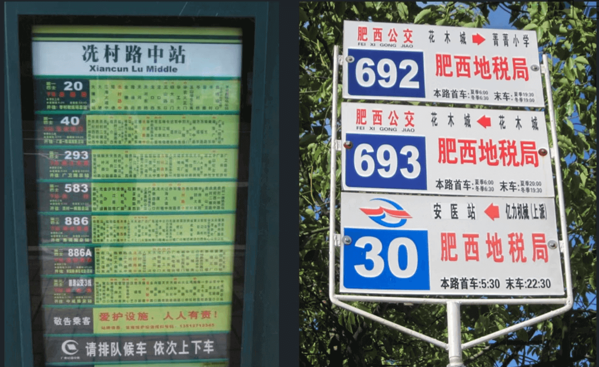
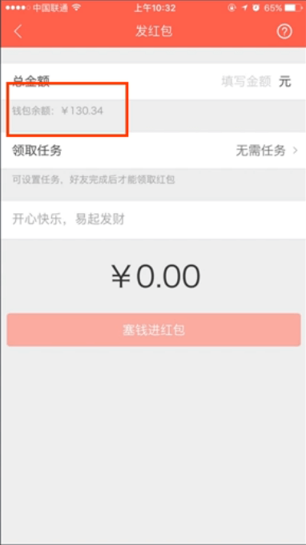
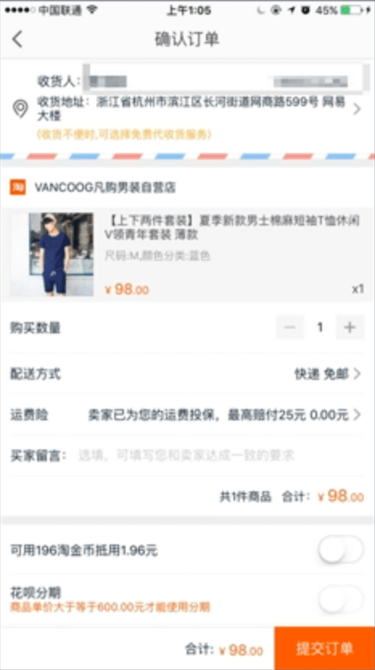
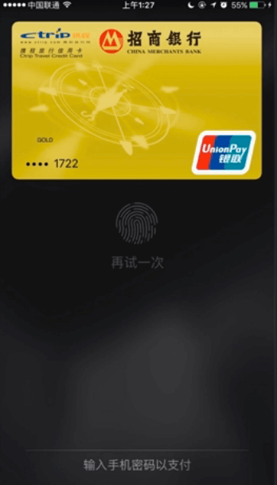

# 用户体验分析方法

每次在进行用户体验分析之前，我们需要思考两个问题：

- 目标用户是谁？核心需求是什么？使用场景是怎样？
- 从哪些方向进行评估？

## 目标用户、核心需求、使用场景

当我们分析上面公交站牌的用户体验时，我们需要了解公交站牌的目标用户、他们的核心需求以及使用场景。

||分析1|分析2|分析3|
|---|---|---|---|
|目标用户|固定乘客（每天都在这里上下班的乘客）|新乘客（新来到这个站的乘客）|车上的新乘客（通过公交来到这个站的乘客）|
|核心需求|无|找某路车、找去某个地方的车|确认是不是到站|
|使用场景|无|站在站台前1-2米距离，时间比较充裕|在车上，距离3-5米，视野不好，时间紧迫|

通过目标用户、核心需求和使用场景的分析，我们对于目标用户的了解就更深入了，接下来就是对公交站牌进行分析了。

## VIMM 分析法

VIMM分析法是用户体验分析的常用方法，它从以下四个方面对用户体验进行分析。

- Visual 		视觉（优化视觉感官，关键信息是否清晰明了）
- Intelligence 	智力（理解和决策过程，用户是否能毫不费力地了解）
- Memory 		记忆（最小记忆负担）
- Move 			行动（优化操作效率）

下面将从VIMM四个方面分析公交站牌的用户体验。

**视觉上**

- 右边站牌站点名称这个关键信息不清晰，对于分析3中的乘客判断是否到站造成麻烦。
- 右边站牌信息分布不清晰，对于分析2中的乘客查找公交线路造成不便。
- 右边元素蓝红搭配显得突兀，而左边搭配深绿和浅绿搭配层次渐进。

**智力上**

- 右边站牌重复信息过多，让人难以准确定位需要的信息
- 右边站牌从花木城到菁菁小学是从首站到微站，还是到下一站是菁菁小学，缺乏线索标明
- 右边站牌顶部第一块站牌的始终点是从左向右的方向，而下面两块站牌则是从右向左的方向，逻辑不统一。
- 右边站牌中间的一块站牌，始发和终点都是花木城，会让用户无法理解。

**记忆上**

- 左边站牌排版和格式统一，统一规范有利于记忆。
- 左边站牌里每路公交里的站点列表都用红色标出当前站点，这样有利于减轻记忆负担。这样当用户需要看这一站的下一站是哪个站点的时候会非常方便。

**行动**

- 右边站牌没有站点的信息，可能是在后面，这样当要看下一站的公交站点信息时需要移动到另外一边查看，效率低。

## 案例

**面包旅行（智力）**

面包旅行的产品列表页面里，价格的标签归属不够明显，让人不知道这个价格标签到底是上面这个商品的，还是下面这个商品的，这加大了用户对于产品的思考。

**易信红包余额提示（记忆）**

一般用户红包的时候都会看看零钱里的余额，然后去发一个少于余额的红包，这样用户就要去记零钱里有多少余额，这样用户就有了记忆的成本。本着减少用户记忆的原则，易信在发送红包界面直接显示了用户的钱包余额，极大了方便用户使用。同样的，其实支付宝在提现的时候也有这个提示功能。

**淘宝支付（行动）**

在手机淘宝用户点击立刻购买之后会跳到确认订单页面，这个页面就存放了大量的信息，一开始看上去会觉得非常难以理解。因为我们知道，要让页面看起来很容易理解，那就需要一个页面只做一件事情，这样确认订单整个流程就会非常繁琐。所以这个就涉及到智力和行动两个方面的权衡问题了，需要根据不同的场景进行具体分析，总的来说，应该是：**高频操作重效率，低频操作重认知。**在淘宝上购买东西，一般用户的目的性都是很强，而且也比较熟悉了，所以智力上的了解对于他们来说并不是很困难，相反效率对于他们来说反而更加重要，他们是更希望快点买到自己要买的东西的，而不是点了4、5个页面还不能购买。

**Apple Pay（行动）**

Apple Pay绑定银行卡后如何使用呢，这个功能其实是隐藏得非常深的，答案是：双击home键。这时候就是行动（效率）和智力上的权衡了，因为Apple Pay的目的是替代信用卡，所以在效率上必须快，这样在智力上就会显得比较难以理解，所以也可以理解。

**总结：记忆与视觉、智力与行动某些时候是相悖的，要注意体验的取舍。**