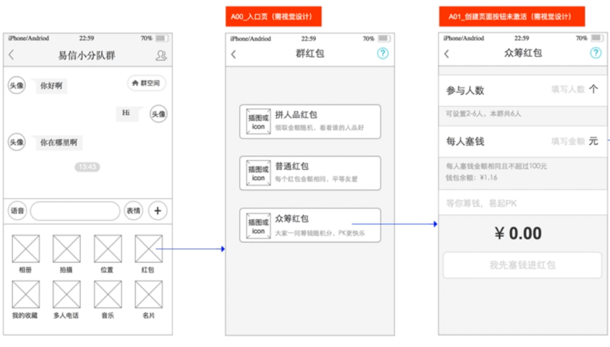
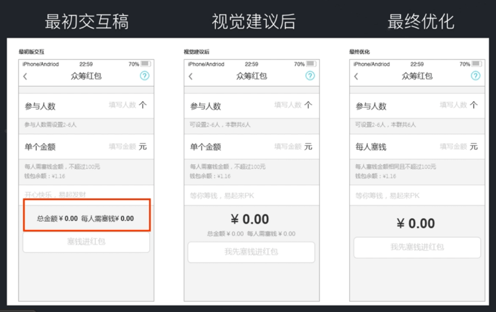

# 如何开展工作

如何通过交互原型设计出用户界面

## 设计流程

- 读懂交互原型
- 了解用户三要素。目标用户、核心需求、使用场景。
- 竞品分析。
- 开始设计。

### 读懂交互原型

读懂交互原型主要是看看关键流程的交互是否顺畅，有没有不合理的设计。

**易信众筹红包例子**

- 找关键任务，代入用户场景

在众筹红包例子中最重要的就是发红包的流程，因此这个便是关键任务。看看这个关键任务的交互是否流畅至关重要。

- 找出难以理解的点积极交流

在塞红包界面底部有关于总金额以及每人需要塞多少钱的说明，整个页面没有突出的重点，文字也很长，看上去很乱，而且常常的文字会让用户需要去思考这个是什么东西。这种情况下就需要进行修改，经过两次修改，去掉了关于总金额以及塞多少钱的提示。因为“每人需要塞多少钱”这个逻辑在之前的玩法介绍页面已经说过了，并且前面输入框也有提示了，因此完全可以去掉。而用大号的数字金额直接替代文字“总金额”的提示，能让整个页面重点突出，并且清晰明了。

### 用户三要素

- 目标用户：发起者、参与者、围观者
- 核心需求：小成本发起互动娱乐、竞技
- 使用场景：易新群里、参与的人有时间差

### 竞品分析

关注竞品（微信、支付宝等）的操作流程、文案、区块划分、突出的视觉元素。

### 开始设计

