# 基础篇：让你的设计更容易理解

**UI设计的核心价值是什么？**

—— 传达信息（情感、界面逻辑、品牌价值等）。

接下来从**逻辑、时间、呈现、控件、表达**五大方面来表达如何让设计更容易理解。

## 逻辑问题（格式塔心理学）

设计中的逻辑问题很多时候可以用`格式塔心理学`来设计。

>**格式塔学派**主张人脑的运作原理是整体的，“整体不同于其部件的总和”。例如，我们对一朵花的感知，并非纯粹单单从对花的形状、颜色、大小等感官资讯而来，还包括我们对花过去的经验和印象，加起来才是我们对一朵花的感知。

***格式塔心理学是设计中非常重要的知识，作为设计的人都应该好好学一学格式塔心理学。***

格式塔心理学提出了做易于理解的设计的五大原则：**简单、相似、接近、闭合、连续。**

### 简单

简单指的是人的大脑习惯把看到的事物简化，如果大脑无法简化所看到的事物，那么就会呈现出复杂或者无法接受的情绪。

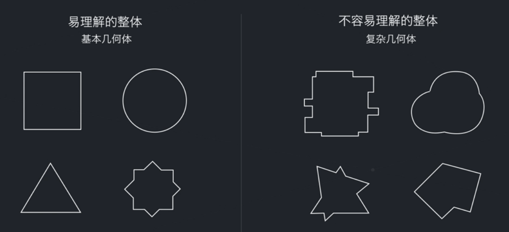

**例子**

大脑习惯性会把看到的东西简单化成几何图形

我们的日常设计也要简化成最简单的几何图形才能更容易被理解

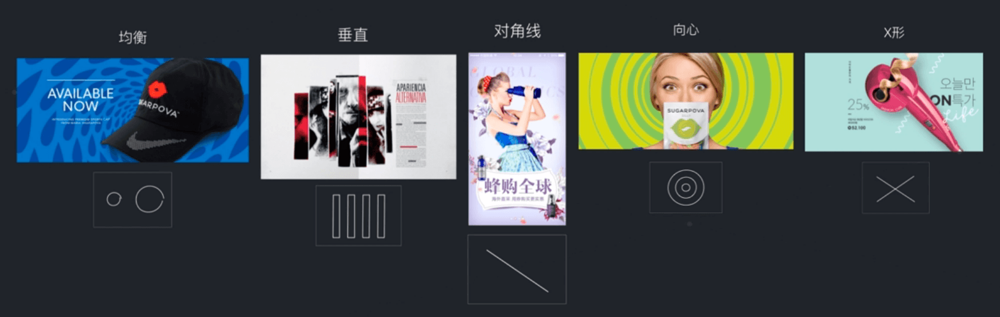

### 相似

我们的眼睛很容易注意到那些外表相似的物体，而且不管它们的位置是否相邻，总是会把它们联系起来。

下面这幅图中，有形状、大小、色彩不同但相似的图形。其中**形状不同**用在区分不同类型的信息，并且这些信息的重要程度相同；**大小不同**用在区分信息的重要程度上；**色彩**能够形成分类，多数用在突出某种类型的环境（与形状分类的区别是它有突出某种类型的作用）。

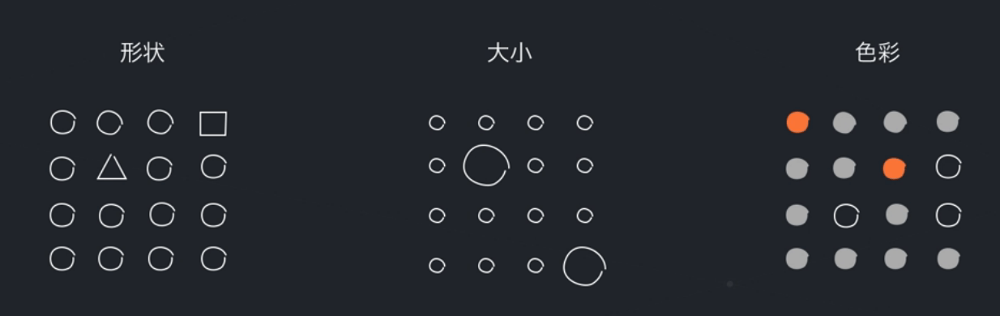

**例子**

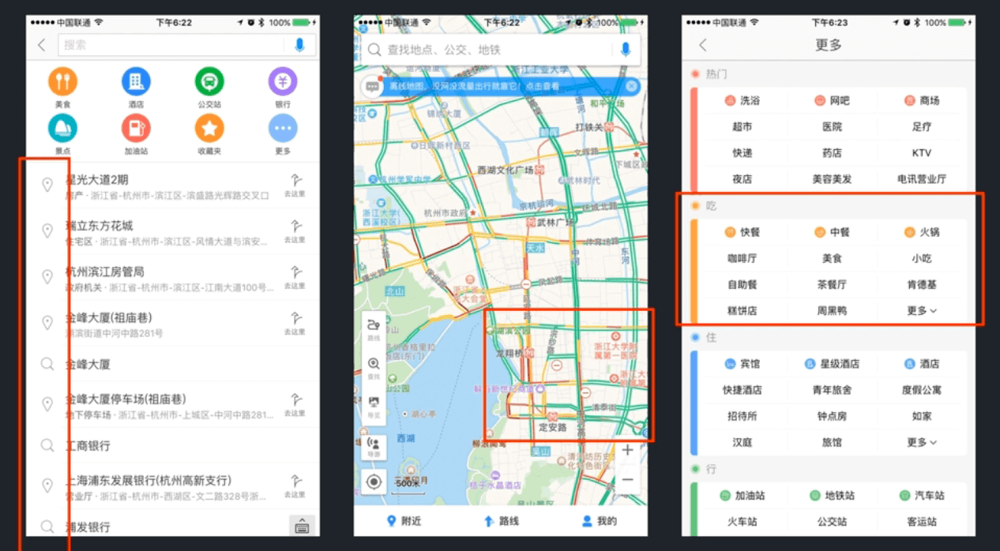

### 接近

人们习惯把相对接近的元素看成是一个整体。例如下面的图我们一般会觉得图里有4组圆，我们把许多小圆看成了一个整体，而不会把一个小圆看成一个整体。

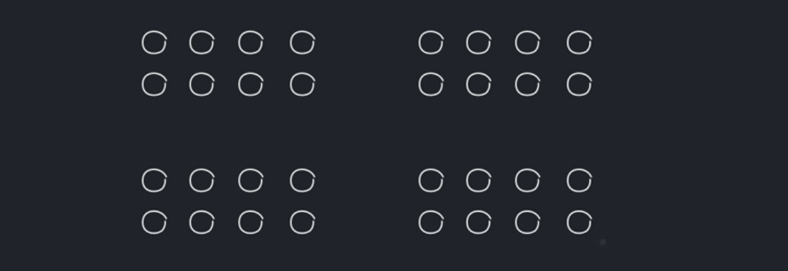

>**设计实践：**不同元素之间的距离可以让你感知到元素之间的关系，而不需要用具体的线条来分隔。

**例子**

通过适当的间距可以让你感知不同元素之间的关系，而无需使用具体的线条。

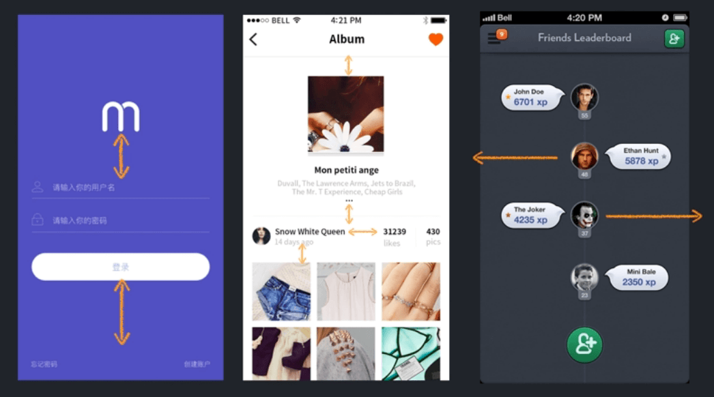

左边的图间隔大致相同，视觉上没有太大不同，因此视觉上比较难以区分。而右图则用不同的间距区分不同的信息重点，这在视觉上会更加清晰。

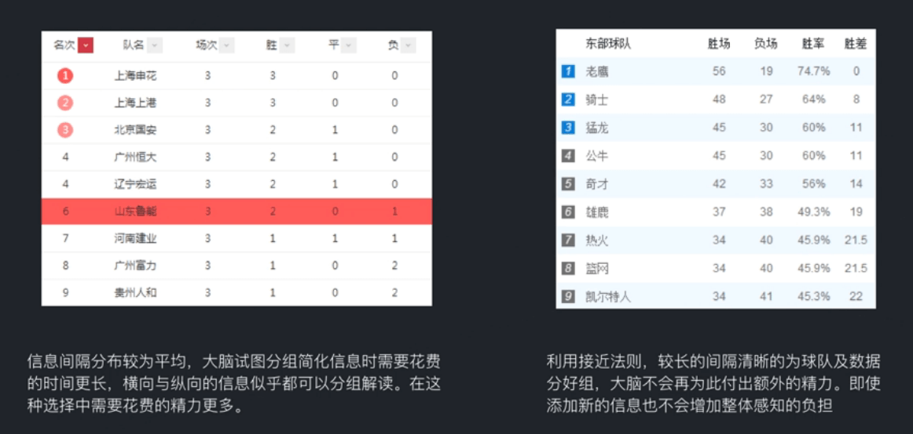

### 闭合

大脑趋向于将不连续的物体当成一个完整的个体来看待。

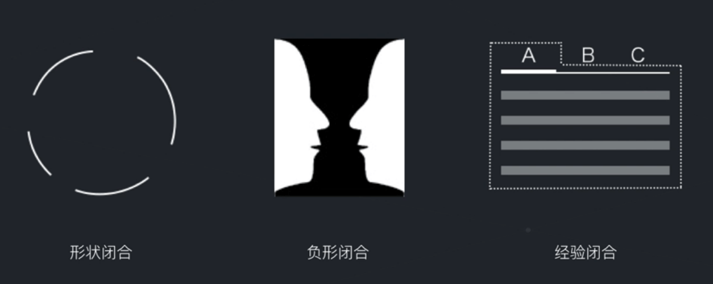

### 连续

人的视觉有随着一个方向延续的习惯，会把这些元素联系起来，形成方向感。连续和闭合比较接近。

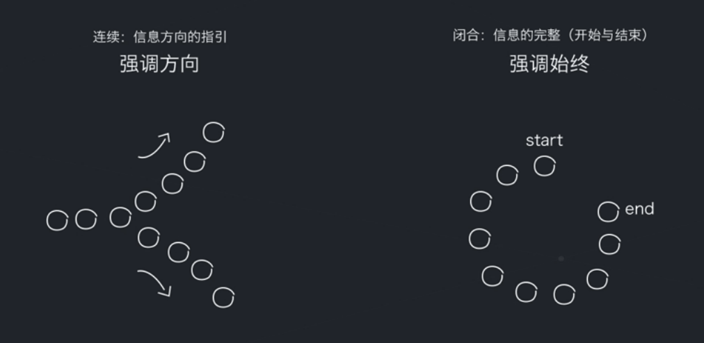

**例子**

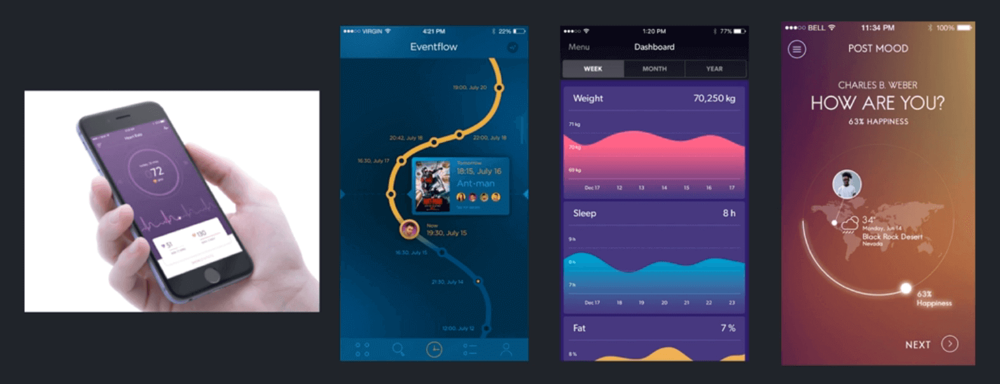

### 视觉元素的逻辑关系

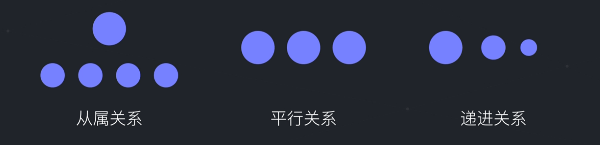   

下面的头像和右边的文字说明就是从属关系。

   

## 区域设计

视觉信息处理过程

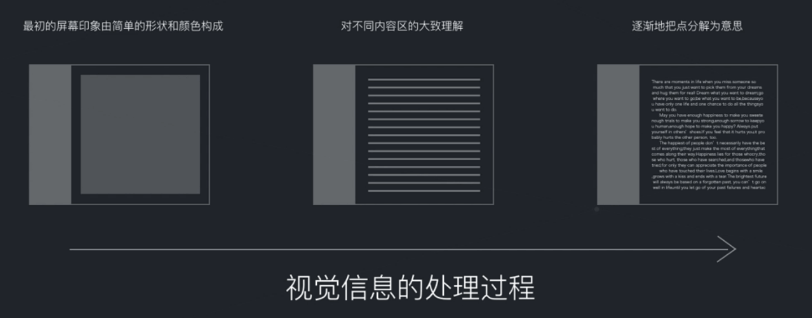 

下面的APP界面区块划分都非常清晰，我们一下子看上去就可以很清晰地明白有几个区块。

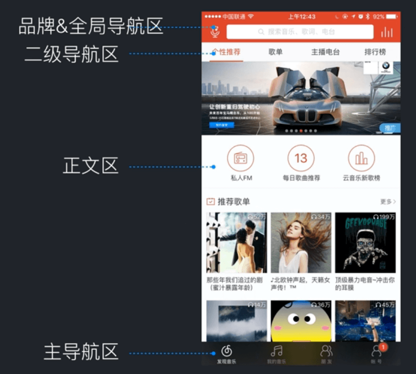

>**设计实践**：先做大的框架、再注意细节，这样才符合大脑对视觉信息的处理原理。

## 时间问题

在设计的时候我们要关注时间对受众的影响，比如设计APP启动界面时往往用户往往只有几秒的阅读时间，此时设计的时候就需要考虑用户能否在这么短的时间内阅读完我们的设计，并领会到我们要表达的意思。

>
- **设计原则1**：短时记忆里，正常人只能记住5-9个互不相关的信息单元。
- **设计原则2**：7个字以内的标题更容易被阅读。

**例子**

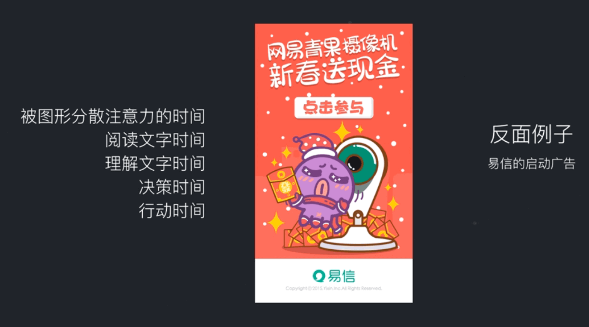

## 呈现问题

当一些相对颜色的文字在一起出现时，人眼很难集中注意力。此时，我们注意设计的界面是不是能够让用户看清楚。

**反面的例子**

第一个界面下面的文字看不清楚了，第二个界面主LOGO看不清楚了。

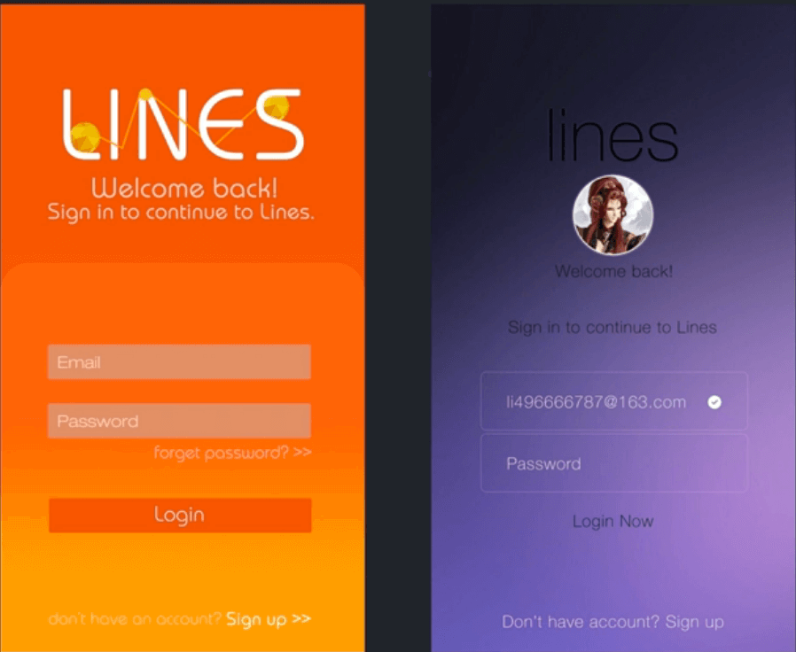

## 控件问题

控件设计的时候要注意相同类型的空间要保持相同的样式，不然会让用户困惑。

**例子**

下面的例子中“忘记密码”和“其他方式登录”一个可以操作，而另一个无法操作，但这里设计成了一样的样式，会让用户觉得困惑。

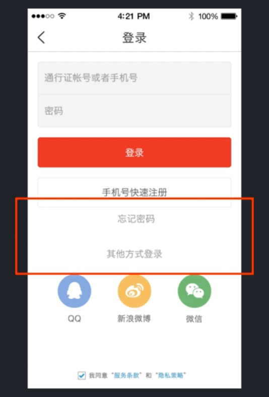

「默认行距」这里是无法点击的，但是放在这里会觉得它是可以点击的，会给用户觉得困惑。

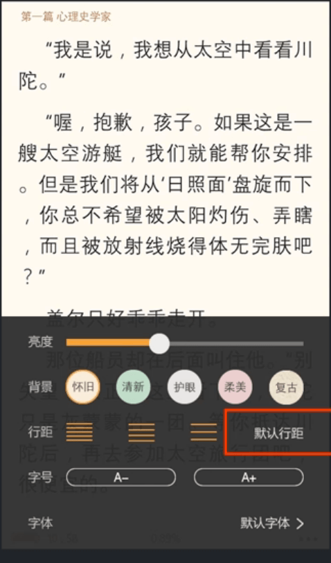

## 表达问题

### 写作技巧：倒三角

先把要表达信息的总结写出来，然后越写越细，有利于用户理解。

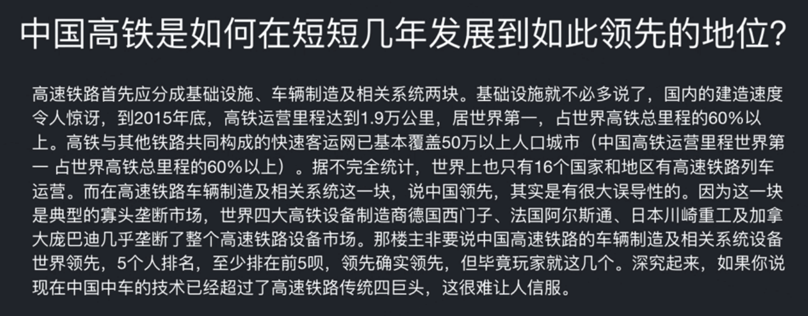

### 写作技巧：无序列表

对可以通过列表展示的通过列表展示

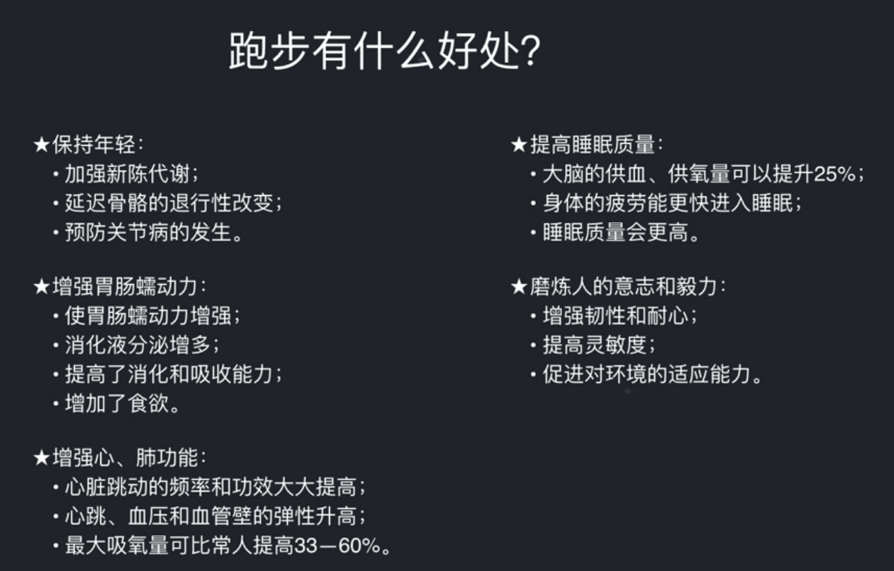

### 写作技巧：有序列表

对可以通过列表展示的通过列表展示

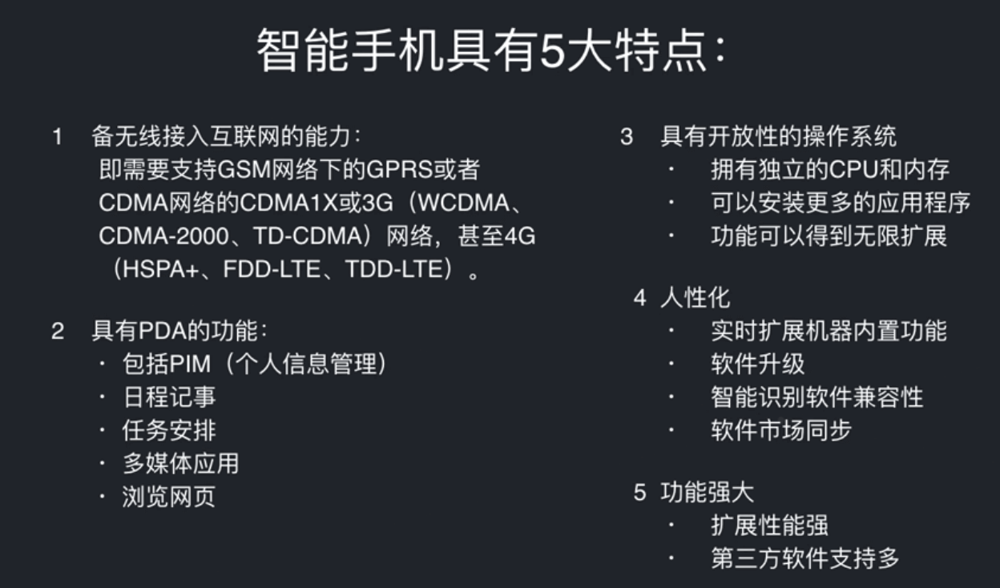

### 写作技巧：文不如表、表不如图

在理解程度上：图形 > 表格 > 文字

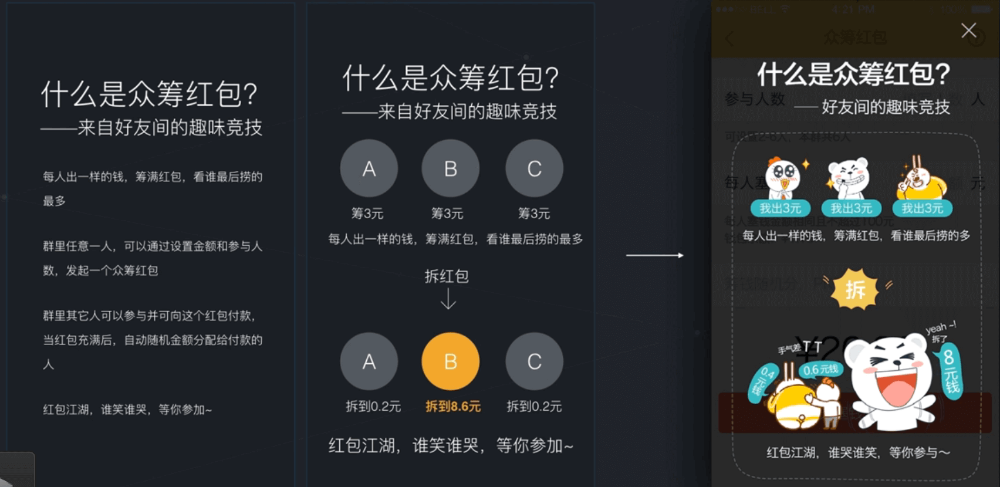

