# 优秀篇：舒适顺畅的界面设计

一个舒适流畅的界面会有许多要点，例如：视觉流、视觉元素、视觉一致性、交互一致性等。

## 视觉流

如果视觉设计就是通过界面和用户沟通的语言，那么视觉流就是说话的顺序。

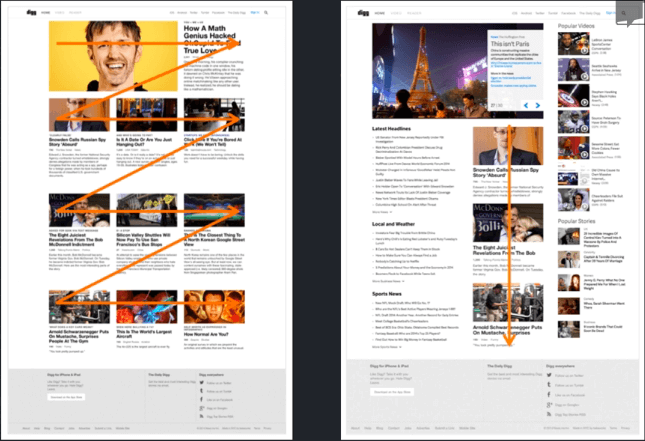

**如何设计视觉流？**
   
- 先理顺信息（确保完整性和价值）   
- 控制视觉流（想清楚对用户传达信息的顺序，然后用设计的方法去引导用户）

**各种视觉元素影响瞩目度排序**

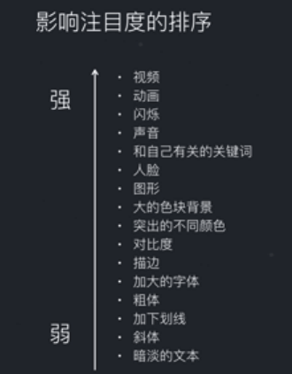

**例子**

展览的海报视觉首先会落在展览时间上，之后如果用户感兴趣就会发现这是一个设计展，在左下角和右下角又可以找到具体的时间和地点。主次分明，视觉流控制得比较恰当。

这个网站视觉的中心落在VTC云直播的文字上，能让人知道这个是什么东西，但右边的图例说明太过于复杂，而且太过于细节化，会让用户觉得难以理解。

**多用户多需求的情况如何进行设计？**

多用户需求的情况下，要识别有哪些用户？他们有什么目的？如下淘宝首页通常有两类用户，一类是有明确目的的用户（比如要买U盘的用户），另一类是只想随便逛逛的用户。淘宝通过大块色块将导航栏标识出来，让有明确目的的用户一下子可以找到对应的栏目。而商品陈列区域则通过更加多元化的图片来吸引用户注意。

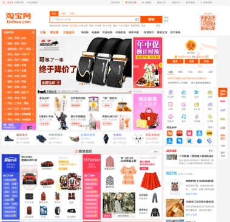

## 视觉元素

>视觉元素是界面中能影响到用户感知器官的元素。

视觉元素可以分为显性元素和隐性元素。

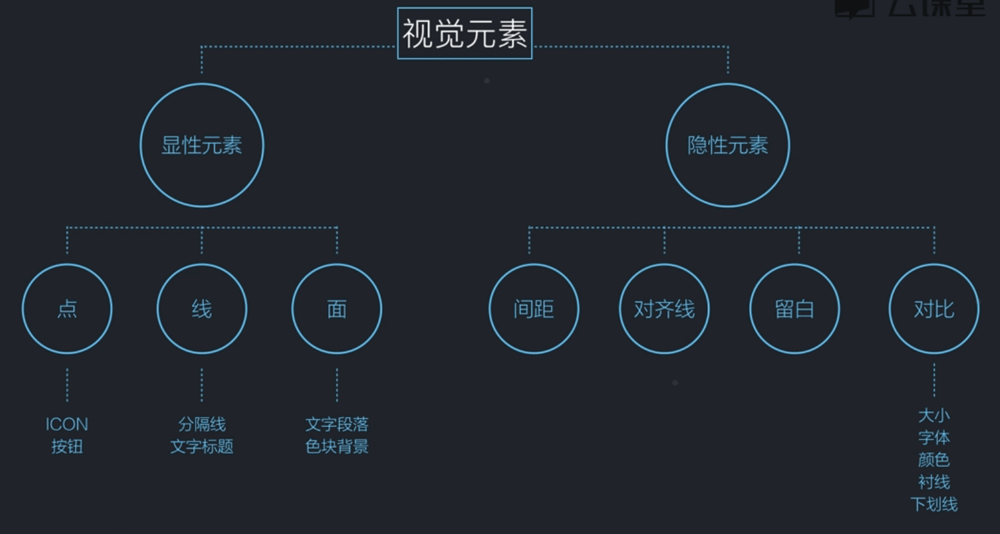

**例子**

BANNER初稿与终稿的对比：

- 底部文字去掉了颜色深浅的变化，因为字体大小已经能够体现信息重要程度，因此去掉了颜色这一个视觉元素。
- 底部三行文字的对齐线有三条，一行各一条，但终稿减少到了两条，减少了对齐这一个视觉元素。
- 初稿和四边边界的间距都不同，但终稿统一了边距，减少了间距这一个视觉元素。

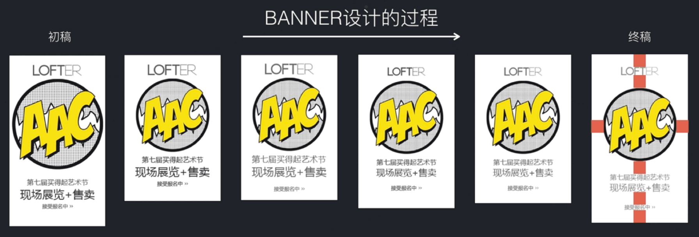

**优秀的设计就是在保证可用性的前提下把视觉元素优化到最少。**

比较一下下面两幅图，哪个更好看？

一般人都会觉得右边的图好看。右边的视觉元素做到了极简，所以看起来比较干净。右图的色彩运用极简，不滥用。而左边的图从色彩、字体以及各种元素上都用得太多，视觉元素太杂乱。

## 一致性

一致性是指一个产品中相同的内容要保持呈现统一。一致性一般从**视觉、交互、文案**三个方面去判断。

### 视觉一致性

**反面的例子**

百度糯米支付页面面包屑不统一

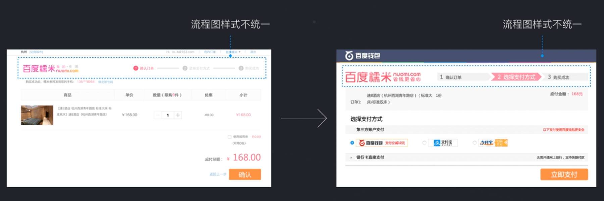  

豆瓣页面的按钮颜色以及大小不统一

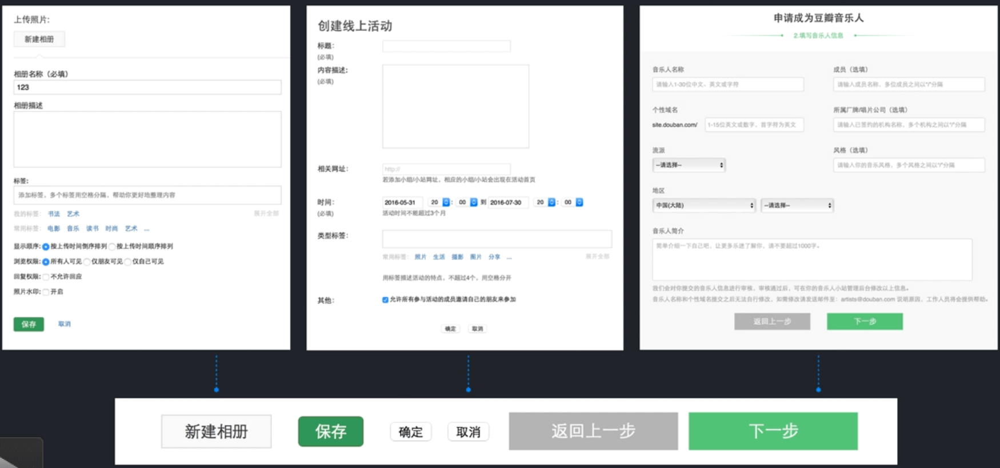  

**正面例子**

微信弹窗

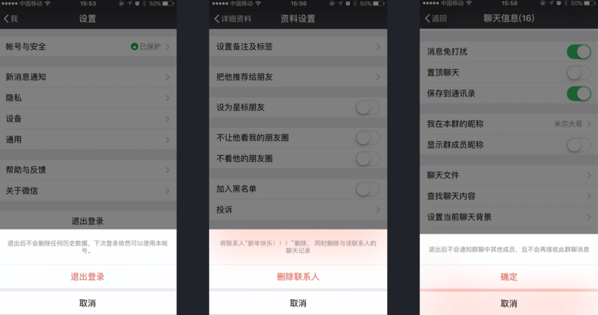  

手机淘宝页面

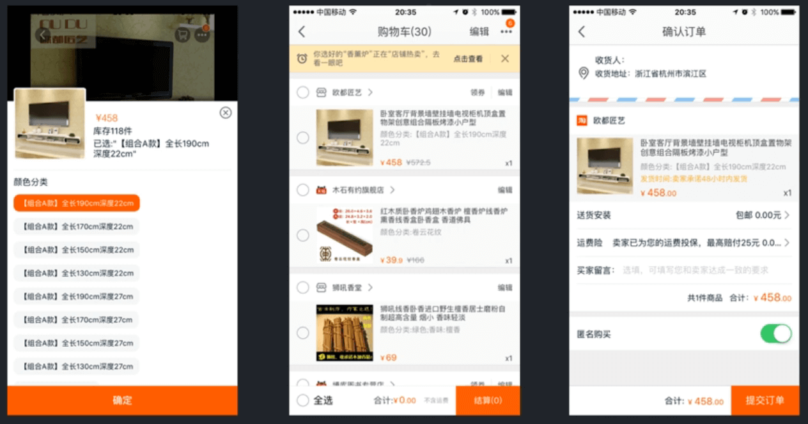  

### 交互一致性

**反面例子**

下面左边是天涯论坛发布帖子的页面，右边是发布悬赏的页面，它们底部都使用了文章分类的控件，但是其控件样式以及位置却不一样，这样会加大用户的学习成本。

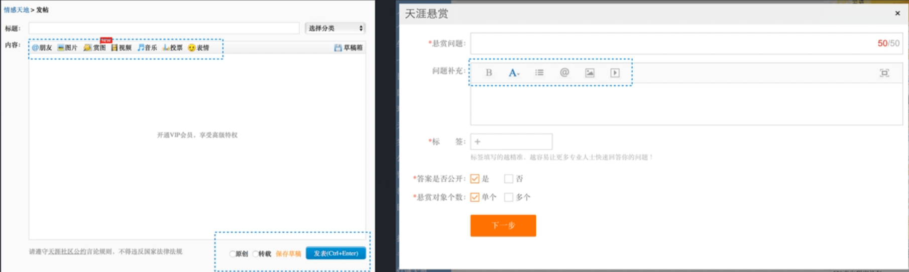

中国移动充值流程里的确认按钮一个放在中间，一个放在右下角，这样的交互不统一会加大用户的学习成本。

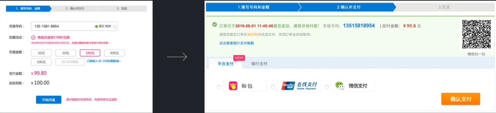

**正面例子**

花瓣APP里相册和拍照点进去的页面格式是一样的，这样的交互统一会减少用户的学习成本。

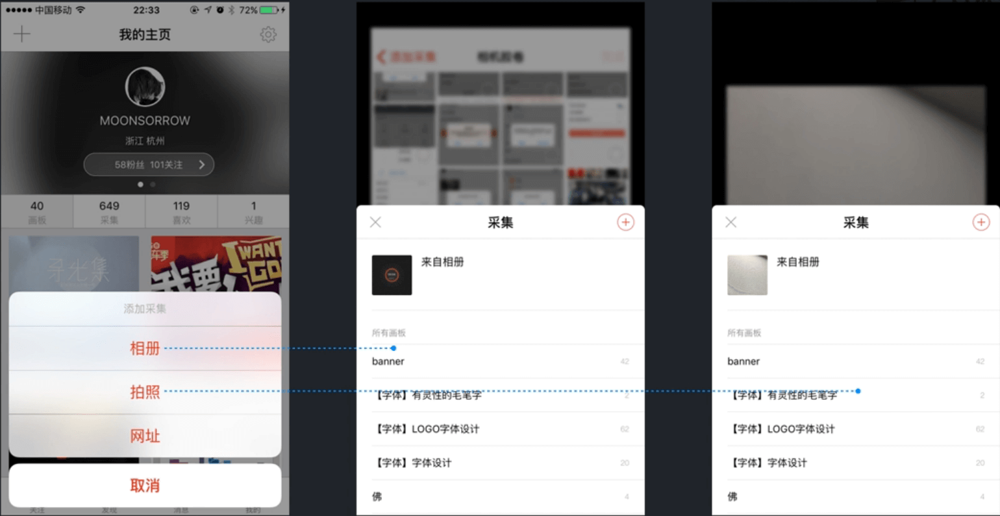

QQ空间写日志和发表说说的页面样式基本相同，这样用户就可以减少用户学习成本，直接对比哪些不同就可以了。

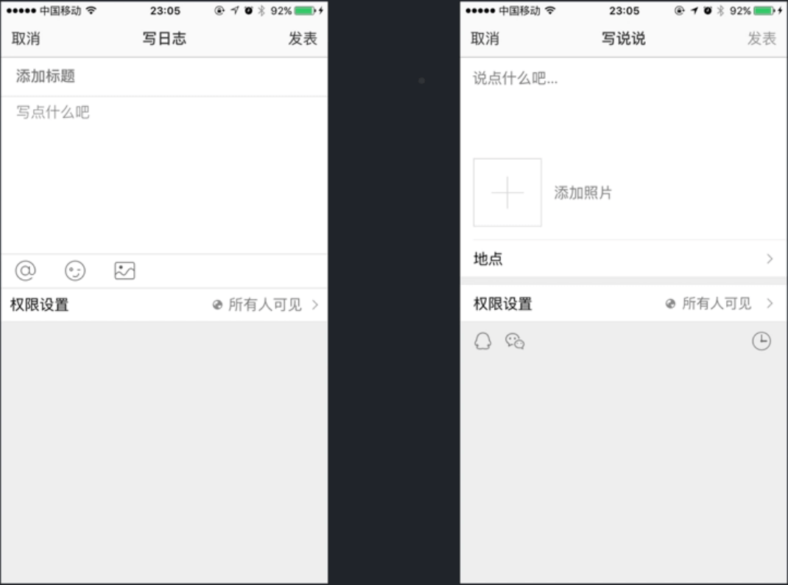

### 文案一致性

**反面例子**

上下文关键字不统一会造成困惑。标题里说到「三步教你安全选购进口食品」，但是正文中却没有提到具体那三步，这就造成用户困惑。

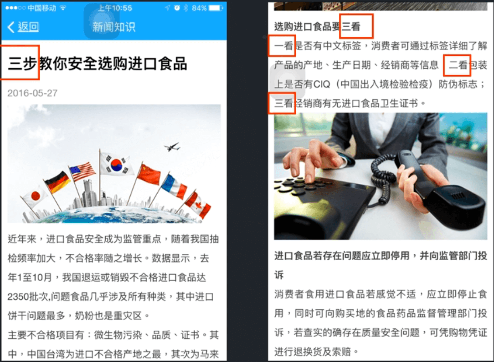

左边是团购，右边是点评团，出现文案不统一。

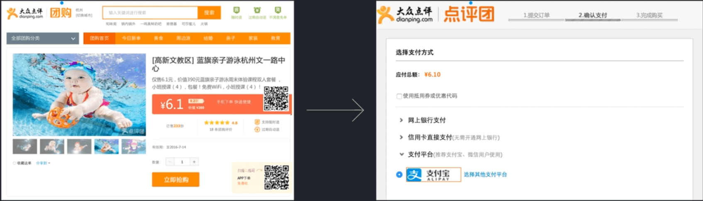

## 其他

- **四四分组原则。**设计中遇到长串的字符，按照四四分组的原则将字符串分隔，这样可以让用户阅读得更轻松。
- 在设计表框信息填写时，对用户填写的信息要及时反馈，并且提醒信息要靠近对应的表框。