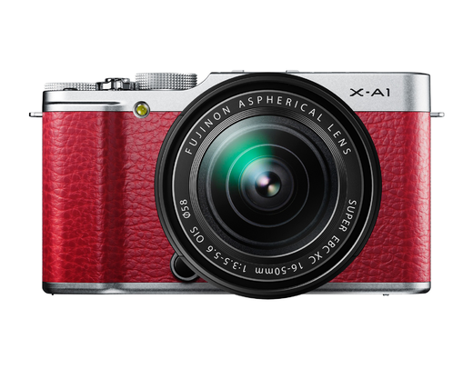
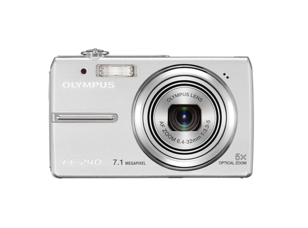
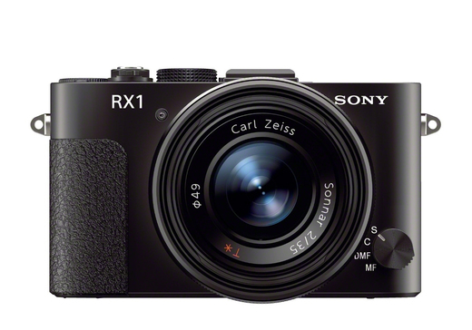
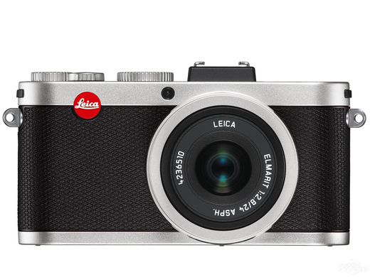
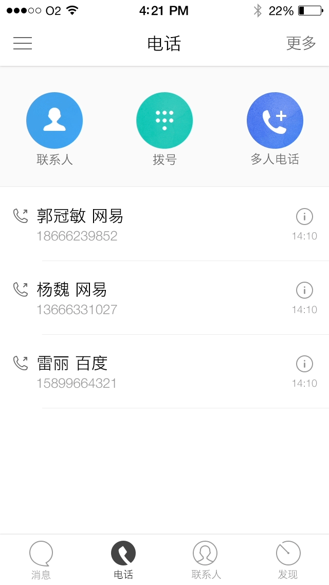
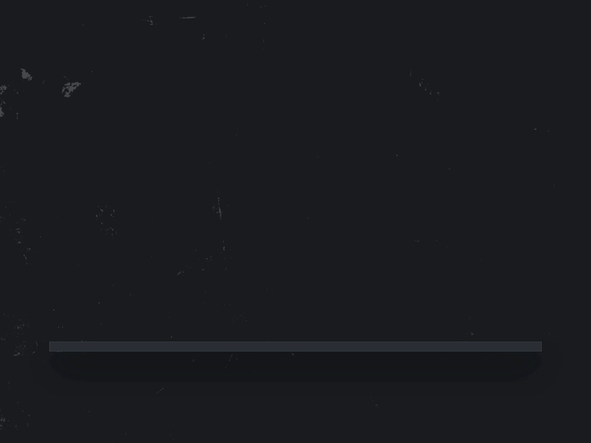
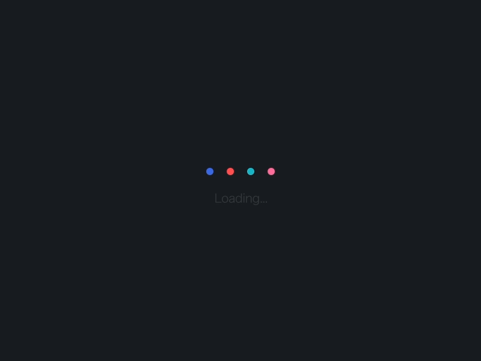

<!-- START doctoc generated TOC please keep comment here to allow auto update -->
<!-- DON'T EDIT THIS SECTION, INSTEAD RE-RUN doctoc TO UPDATE -->
**Table of Contents**  *generated with [DocToc](https://github.com/thlorenz/doctoc)*

- [作业](#%E4%BD%9C%E4%B8%9A)
  - [第一章：UI设计概述](#%E7%AC%AC%E4%B8%80%E7%AB%A0%EF%BC%9Aui%E8%AE%BE%E8%AE%A1%E6%A6%82%E8%BF%B0)
    - [收集设计素材及素材分析](#%E6%94%B6%E9%9B%86%E8%AE%BE%E8%AE%A1%E7%B4%A0%E6%9D%90%E5%8F%8A%E7%B4%A0%E6%9D%90%E5%88%86%E6%9E%90)
    - [UI设计攻略 测验](#ui%E8%AE%BE%E8%AE%A1%E6%94%BB%E7%95%A5-%E6%B5%8B%E9%AA%8C)
  - [第二章：修炼设计技法](#%E7%AC%AC%E4%BA%8C%E7%AB%A0%EF%BC%9A%E4%BF%AE%E7%82%BC%E8%AE%BE%E8%AE%A1%E6%8A%80%E6%B3%95)
    - [扁平化ICON设计](#%E6%89%81%E5%B9%B3%E5%8C%96icon%E8%AE%BE%E8%AE%A1)
    - [半写实ICON设计](#%E5%8D%8A%E5%86%99%E5%AE%9Eicon%E8%AE%BE%E8%AE%A1)
    - [从视觉解析一款完整的app设计作业](#%E4%BB%8E%E8%A7%86%E8%A7%89%E8%A7%A3%E6%9E%90%E4%B8%80%E6%AC%BE%E5%AE%8C%E6%95%B4%E7%9A%84app%E8%AE%BE%E8%AE%A1%E4%BD%9C%E4%B8%9A)
    - [电话拨号界面动效临摹](#%E7%94%B5%E8%AF%9D%E6%8B%A8%E5%8F%B7%E7%95%8C%E9%9D%A2%E5%8A%A8%E6%95%88%E4%B8%B4%E6%91%B9)
    - [小球掉落动效临摹](#%E5%B0%8F%E7%90%83%E6%8E%89%E8%90%BD%E5%8A%A8%E6%95%88%E4%B8%B4%E6%91%B9)
    - [Loading动效临摹](#loading%E5%8A%A8%E6%95%88%E4%B8%B4%E6%91%B9)
  - [第三章：设计规范与流程](#%E7%AC%AC%E4%B8%89%E7%AB%A0%EF%BC%9A%E8%AE%BE%E8%AE%A1%E8%A7%84%E8%8C%83%E4%B8%8E%E6%B5%81%E7%A8%8B)
    - [移动端设计规范 作业](#%E7%A7%BB%E5%8A%A8%E7%AB%AF%E8%AE%BE%E8%AE%A1%E8%A7%84%E8%8C%83-%E4%BD%9C%E4%B8%9A)
    - [WEB端设计规范 测验](#web%E7%AB%AF%E8%AE%BE%E8%AE%A1%E8%A7%84%E8%8C%83-%E6%B5%8B%E9%AA%8C)
  - [第四章：提升用户体验](#%E7%AC%AC%E5%9B%9B%E7%AB%A0%EF%BC%9A%E6%8F%90%E5%8D%87%E7%94%A8%E6%88%B7%E4%BD%93%E9%AA%8C)
    - [用户体验概述 作业](#%E7%94%A8%E6%88%B7%E4%BD%93%E9%AA%8C%E6%A6%82%E8%BF%B0-%E4%BD%9C%E4%B8%9A)
    - [打造优秀用户体验的UI设计 作业](#%E6%89%93%E9%80%A0%E4%BC%98%E7%A7%80%E7%94%A8%E6%88%B7%E4%BD%93%E9%AA%8C%E7%9A%84ui%E8%AE%BE%E8%AE%A1-%E4%BD%9C%E4%B8%9A)
  - [第五章：设计审美](#%E7%AC%AC%E4%BA%94%E7%AB%A0%EF%BC%9A%E8%AE%BE%E8%AE%A1%E5%AE%A1%E7%BE%8E)
    - [做不“丑”的设计 作业](#%E5%81%9A%E4%B8%8D%E2%80%9C%E4%B8%91%E2%80%9D%E7%9A%84%E8%AE%BE%E8%AE%A1-%E4%BD%9C%E4%B8%9A)
    - [更美的设计 作业](#%E6%9B%B4%E7%BE%8E%E7%9A%84%E8%AE%BE%E8%AE%A1-%E4%BD%9C%E4%B8%9A)
    - [如何提高审美 作业](#%E5%A6%82%E4%BD%95%E6%8F%90%E9%AB%98%E5%AE%A1%E7%BE%8E-%E4%BD%9C%E4%B8%9A)

<!-- END doctoc generated TOC please keep comment here to allow auto update -->

# 作业

## 第一章：UI设计概述

### 收集设计素材及素材分析

作业内容：

- 1.收集10幅自认为从美观、参考价值、稀缺度都最高的设计作品。
- 2.10幅作品分别为其写一段设计分析。分析方向可以是你对这份设计的欣赏点，也可以是能借鉴学习的点。

作业要求：

- 1.作品美观度：配色、字体、质感等
- 2.可借鉴价值：是否抓住用户心理、是否注重用户体验、品牌价值等
- 3.素材的稀缺度：素材的来源等
- 4.语言组织：表达完整，准确描述素材特点，文案简要明了，用词得当等

作业说明：

这个是针对刚入门的同学，从审美、设计分析和素材挖掘等能力的一个综合入门训练，希望能通过收集和分析设计作品等具体过程，让大家感受UI设计师的思考方式。

请同学们通过各种渠道（如花瓣等）来收集10个自己比较欣赏的设计作品，这些作品的形式和范围可以不限于互联网，但比较推荐是互联网相关设计，可以是APP的UI设计，也可以是日常生活遇到的工业设计等。关键条件是必须要有可以值得借鉴的地方（借鉴的维度在课程里有介绍：配色、字体等）。

除了收集，还需要对这10个作品分别做个简单的作品点评。大致描述一下欣赏这个作品的什么地方，如果自己要做类似的设计，关键是要如何把握等等，尽可能把技术要点提炼出来。这一步是希望能锻炼把自己脑海里的感觉转化为能传播的语言。

作业提交形式：
素材收集：图片或PDF
设计分析：PDF
将两个作业打包成压缩包上传（10M以下）

### UI设计攻略 测验

- 1.在整个APP开发的流程中，UI设计要画具体的界面，需要先获得什么材料？

	- A.产品策划输出的需求文档

	- B.交互设计提供的交互原型

	- C.产品运营提供数据分析

	- D.用户研究人员提供调研报告

- 2.UI设计属于哪一个层的工作？

	- A.结构层

	- B.表现层

	- C.战略层

	- D.战术层

- 3.UI设计最终的核心目的是什么？

	- A.美观

	- B.追求产品的商业价值最大化

	- C.符合交互稿要求

	- D.好用

- 4.从零基础新手要成为UI设计师，下面的发展路径中，哪一项是最重要并且消耗精力最多？

	- A.熟练PS技术

	- B.丰富设计理论

	- C.累积经验和作品

	- D.临摹ICON和APP界面

- 5.课程里有讲到面试的技巧，其中设计专业主管在评估应聘者作品的时候，以下有哪一项最不在意？

	- A.关键是设计品味，作品是否能体现出美学修养

	- B.评估应聘者的技能广度，如会不会画ICON及字体设计等

	- C.是否涉猎较多的业务范围，比如APP界面、BANNER、专题活动等

	- D.在个人简历中描述自己有多努力和多受欢迎

## 第二章：修炼设计技法

### 扁平化ICON设计

以图片相机作为基准形（请务必使用讲师提供的文件，自己的素材不得分，素材四选一，设计一款即可！），进行扁平化icon设计。要求如下：

- 1、对于较复杂的技法的掌握
- 2、观察归纳总结造型的能力
- 3、半写实与超写实的区别
- 4、塑造光影和光源
  
提交方式：以图片格式提交。

### 半写实ICON设计

与“扁平化ICON设计”描述一样，但是要设计的是半写实的ICON。

### 从视觉解析一款完整的app设计作业

在iOS平台下，对一款音乐软件（网易云音乐，QQ音乐，虾米 任选其一）进行重新设计，设计两个界面。

- 1.首页列表页面，比如云音乐的“发现音乐”QQ音乐的“音乐馆”等等。
- 2.歌曲播放界面。

交互不强制原创，视觉风格需要重新定义，需要写出设计说明或者思路。要求如下：

- 1.对界面功能性交互的理解
- 2.基础构架 视觉流程，对齐方式等细节的关注
- 3.颜色搭配的合理性
- 4.对iOS端平台尺寸的基本认识

提交：以图片形式提交。

### 电话拨号界面动效临摹

电话拨号界面动效的临摹（只做号码移动上来的动效），不提供psd文件，需运用第二章的技巧，自行临摹界面。请大家以gif格式提交作业。请注意：

- 1.排版整齐和元素对齐
- 2.IOS界面的规范
- 3.动效之间时间间距，以及时间差
- 4.建议画布：640*1136 

基本要求：

- 1.实现课程中的技巧（时间间距、缓入缓出、曲线的调整等）
- 2.模糊的使用方法
- 3.注意移动和透明度的动画细节
- 4.父子级的使用方法

更高的要求：

- 1.独特的动效展现方式
- 2.有更深的创意执行
- 3.完成动效的前因后果（出现，以及拨打页面）

提交方式：以GIF形式，打包成压缩包提交。

### 小球掉落动效临摹

小球掉落动效的临摹，不提供psd文件，需运用第三章的技巧。请大家以gif格式提交作业。

基本要求：

- 1、实现课程中的技巧（时间间距、缓入缓出、曲线的调整等）
- 2、节奏真实，掉落弹起挤压拉伸舒服有吸引力
- 3、多观察动效上的每个细节

更高的要求：

- 1、独特的动效展现方式
- 2、有更深的创意执行

提交方式：以GIF形式，打包成压缩包提交。

### Loading动效临摹

Loading动效的临摹，不提供psd文件，需运用第三章的技巧。请大家以gif格式提交作业。

基本要求：

- 1、实现课程中的技巧（时间间距、缓入缓出、曲线的调整等）
- 2、节奏真实，动效真实有吸引力
- 3、注意时间差之间的节奏调节
- 4、多观察动效上的每个细节

更高的要求：

- 1、独特的动效展现方式
- 2、有更深的创意执行

提交方式：以GIF形式，打包成压缩包提交。

## 第三章：设计规范与流程

### 移动端设计规范 作业

找一个知名产品（有相关工作经验的学员可以选择自己参与的产品）出一份移动端设计规范
要求：

- 1.表达清晰，内容详细完整；
- 2.字体规范，包含app内文字根据使用场景的归类；
- 3.颜色规范，主色、辅色、背景色等颜色的说明和具体色值标注；
- 4.控件规范，每个具体控件的尺寸大，及布局方式的说明；
- 5.标注清晰正确且具体，可将一些说明性文字写在左边区域

### WEB端设计规范 测验

- 1.设计规范是指由视觉设计师定下的对色彩、控件样式、布局排版字体等制定的一系列规则，用来指导之后的设计工作，确保_______的一致性。

	- A.视觉风格

	- B.交互方式  

	- C.页面布局

	- D.用户体验  

- 2.制定设计规范的好处是___________________和提高设计效率。

	- A.指导工作

	- B.带来新技术

	- C.控制设计质量  

	- D.提高产品转化

- 3.设计规范主要是为了这些人而服务：1.开发人员，能更准确的还原设计样式；2.设计师/团队，当新人需要了解产品现状时，需要有一份完整的设计文档；3.______，设计元素严格遵循规范，能给用户传达统一的品牌形象

	- A.部门发展

	- B.小团队

	- C.公司

	- D.个人需求 

- 4.现有iOS手机的屏幕分辨率分别是多少：iPhone5/5c/5s是640*1136，iPhone6是750*1134，iPhone6 Plus是_____________。

	- A.1280*2208 

	- B.1280*1920 

	- C.1242*2208 

	- D.1240*2208

- 5.在移动端的设计中，建议最小字体不小于______px。

	- A.22px

	- B.24px

	- C.20px    

	- D.26px

- 6.在移动端的设计中，所有点击区域尽量不小于______px，如实在满足不了可缩小控件的大小，但是需要保留点击区域的大小。

	- A.80px   

	- B.90px

	- C.84px

	- D.88px

- 7.iOS中主要的手势交互有以下8种，______、拖拽、滑动、双指张开或闭合、双击、轻扫、长按和摇晃。

	- A.点

	- B.反复滑动

	- C.点击

	- D.拉动

- 8.安卓开发最常用的计量单位是_____。

	- A.dp

	- B.cm

	- C.dpi

	- D.px 

- 9.在移动端的文字设计中，标题文字较为适合是____________px。

	- A.36—30px  

	- B.18px—20px

	- C.24px—22px

	- D.26px—30px

- 10.一般切图的图片导出要求是___________。

	- A.GIF

	- B.PNG24 

	- C.JPEG 

	- D.PNG8

- 11.安卓平台通常要求做_________切图。

	- A.1.PNG 

	- B.JPEG

	- C.9.PNG

	- D.PNG   

- 12.web端的设计中，标题性文字通常以______号以上为主。

	- A.22号

	- B.14号

	- C.20号

	- D.16号

- 13.web端的设计中，正文/内容文字通常以12号宋体（像素）、14号宋体/黑体、______宋体/黑体为主。

	- A.16号

	- B.18号

	- C.20号

	- D.22号

- 14.一份完整的设计规范主要包含以下几个内容：1.颜色规范；2.字体规范；3.控件规范；4.图标规范；5___________。

	- A.图示规范

	- B.文字规范 

	- C.大小规范

	- D.布局规范

- 15.切图一般需要提供_____________尺寸。

	- A.2倍和4倍

	- B.1倍和3倍

	- C.2倍和3倍

	- D.1倍和2倍  

## 第四章：提升用户体验

### 用户体验概述 作业

寻找身边的用户体验案例，找两个反面的例子，并对案例做设计说明，描述时要阐述清楚这个功能的问题是什么。并尽量利用用户的三要素（目标用户、核心需求、使用场景）和VIMM的分析维度把该功能的问题描述清楚。

案例范围：不限环境，所有的设计都可以。推荐最好是APP产品，不过日常生活中遇到的场景也行。
报告形式：需要有案例截图或者拍照，并配文说明。

要求：
- 案例找得好不好？
这个体验问题是否容易找；问题价值越高越好，鸡毛蒜皮的小事自然价值就低了。
- 分析描述得好不好？
能不能简要地把问题的前因后果讲清楚；是否抓住重点；如果配上解决方案应该要加分。

### 打造优秀用户体验的UI设计 作业

根据附件交互稿完成5个界面设计，所有需要视觉设计的页面已在页面顶部用红色色块和文字标注，具体内容请见“作业详情”。

要求：
- 设计平台为苹果IOS系统平台，请参照IOS设计规范来进行设计
- 设计尺寸为640px × 1136px

评分说明：
- 美观：界面整齐规范，配色柔和不强烈，界面具有空间感，注重视觉细节
- 用户体验：控件使用规范，视觉设计考虑交互逻辑，并能够在一定程度上优化交互体验、界面逻辑和界面布局
- 品牌：符合产品的特点，并能够在一定程度上强化产品的品牌特征
- 创新：是加分项，可以接受没有创新。如果要创新，一定要注意合理性，不要为了创新而创新。最怕做一些炫酷但不合理的创新，要以实用为核心！

提交方式：将五个页面以图片格式打包上传。

附件：[打造优秀用户体验的UI设计——众筹红包（针对视觉设计的优化版）.zip](../打造优秀用户体验的UI设计——众筹红包（针对视觉设计的优化版）.zip)

## 第五章：设计审美

### 做不“丑”的设计 作业

找出一款自己觉得“丑”APP，指出其“丑”的原因以及设计上存在的问题，对其ICON标以及主要页面进行重新设计。如下要求：

- 1.作业表达清晰，内容详细完整
- 2.案例合理，分析说明到位
- 3.图标重新设计，要求扁平化风格
- 4.界面重新设计，要求扁平化风格，遵循设计的四大基本原则

### 更美的设计 作业

寻找对应到以下四条相关的优秀案例，并做必要分析说明。

- “友好：情感化设计、更好的引导、有趣的等待、”
- “色彩”
- “简洁：做减法、留白、模糊背景”
- “比例：黄金比例、白银比例、对称”

要求：

- 1.内容详细完整，每一条至少一份案例；
- 2.案例美观优秀；
- 3.分析说明到位；

### 如何提高审美 作业

在第二章作业中选择一份自己最欣赏的案例，指出其“美”的地方以及设计上运用到的哪些设计原则，对设计进行临摹并优化（再）设计。要求如下：

- 1.内容详细完整
- 2.案例美观优秀
- 3.分析说明到位
- 4.临摹并优化设计